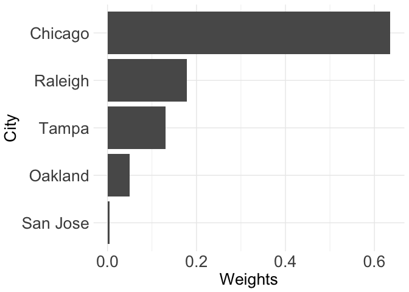
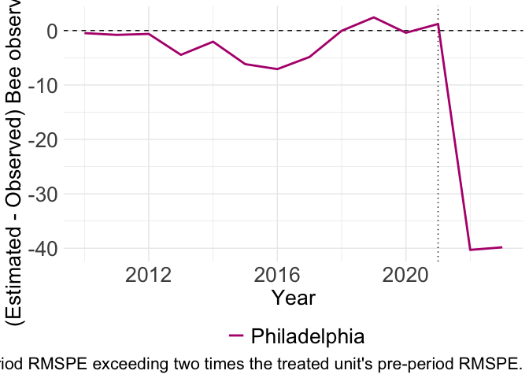
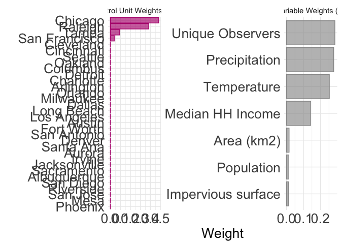
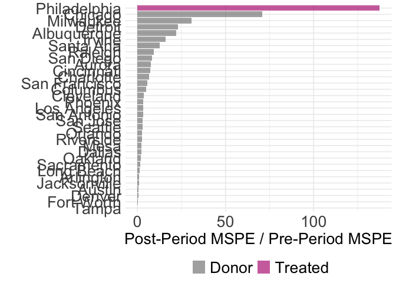
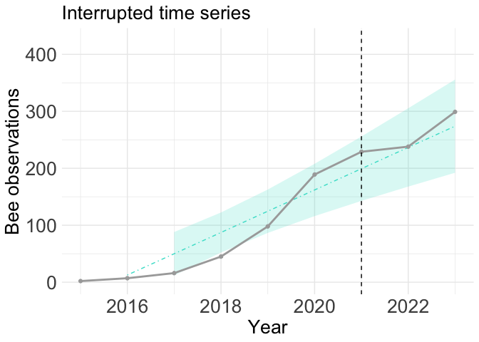
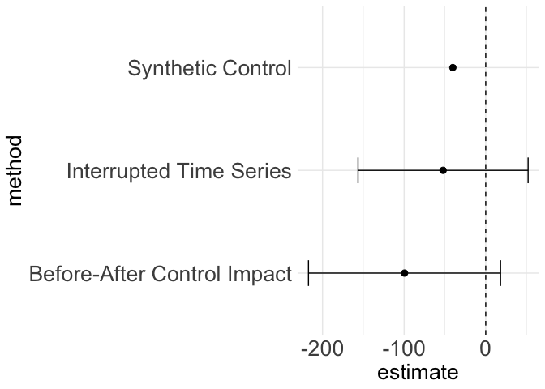

Synthetic Control Analysis
================
Asia Kaiser
2024-10-17

# Load Packages

``` r
library(tidyverse)
```

    ## ── Attaching core tidyverse packages ──────────────────────── tidyverse 2.0.0 ──
    ## ✔ dplyr     1.1.4     ✔ readr     2.1.5
    ## ✔ forcats   1.0.0     ✔ stringr   1.5.1
    ## ✔ ggplot2   3.5.1     ✔ tibble    3.2.1
    ## ✔ lubridate 1.9.3     ✔ tidyr     1.3.1
    ## ✔ purrr     1.0.2     
    ## ── Conflicts ────────────────────────────────────────── tidyverse_conflicts() ──
    ## ✖ dplyr::filter() masks stats::filter()
    ## ✖ dplyr::lag()    masks stats::lag()
    ## ℹ Use the conflicted package (<http://conflicted.r-lib.org/>) to force all conflicts to become errors

``` r
library(tidysynth)
library(nlme)
```

    ## 
    ## Attaching package: 'nlme'
    ## 
    ## The following object is masked from 'package:dplyr':
    ## 
    ##     collapse

``` r
library(AICcmodavg)
library(purrr)
library(ggpubr)
library(microsynth)
```

# Load in Data

``` r
rm(list = ls())
city.data <- read.csv("data/cities.scm.input.csv")
```

DELETE THIS CHUNK AFTER RERUNNING ‘GBIF DATA EXTRACTION SCRIPT’

``` r
#Subset for cities with closer number of observations during treatment year
cities.pool <- city.data %>%
  filter(year == 2021) %>%
  filter(n.obs45km > 75 & n.obs45km < 500)

#Extract the city column
cities.pool <-cities.pool$City

#Keeping subset of cities in final dataframe
#Removing Boston, Atlanta and Baltimore for experiencing this treatment. Removing Houston for abnormal abundance spike in 2016.
city.data <- city.data %>%
  filter(City != "Boston"& City != "Atlanta" & City != "Baltimore" & City != "Houston")%>%
  filter(City %in% cities.pool)
```

# Synthetic Control Analysis: Abundance

## Creating the Synthetic Control

- Creating the control objects
- Selecting the predictors
- Generating weights

``` r
# Create synthetic control object
gbifcity_out <- city.data %>%
  # Initial synthetic control object
  synthetic_control(outcome = n.obs45km, # outcome
                    unit = City, # unit index in the panel data
                    time = year, # time index in the panel data
                    i_unit = "Philadelphia", # unit where the intervention occurred
                    i_time = 2021, # time period when the intervention occurred
                    generate_placebos = TRUE # generate placebo synthetic controls (for inference)
  ) %>%
  
  #Generate aggregate predictors to fit weights to each unit
  generate_predictor(time_window = 2015:2023,
                     Temperature = mean(Temp,rm.na= TRUE),
                     Precipitation = mean(Prec, rm.na= TRUE),
                     Population = mean(Population, rm.na= TRUE),
                     ) %>%
  
  generate_predictor(time_window = 2021,
                     "Tree canopy cover" = tcc45km,                     ,
                     "Impervious surface" = imperv45km,
                     "Area (km2)" = area_km2
                     ) %>%

  # Generate the fitted weights for the synthetic control
  generate_weights(optimization_window = 2015:2021, # time to use in the optimization task
                   margin_ipop = .02,sigf_ipop = 7,bound_ipop = 6 # optimizer options
  ) %>%
  
  # Generate the synthetic control
  generate_control()
```

## Visualizing the data

Creating Personal Theme

``` r
Asia_Theme <- theme(
  plot.title = element_text(size = 20),
  plot.caption = element_text(size = 16),
  axis.title = element_text(size = 20),
  axis.text = element_text(size = 20),
  axis.text.x = element_text(size = 20),
  legend.text = element_text(size= 20))
```

**Trends**: plot of trends of observed (treated) unit compared to
synthetic control over time, with dashed vertical line representing the
treatment event.

``` r
trendplot <- gbifcity_out %>% plot_trends()+
  Asia_Theme +
  labs(title = "Synthetic Control Method", caption = NULL,
        x = "Year",
        y = "Bee observations")+
    ylim(0,425)+
    theme(legend.position = "none")
trendplot
```

<!-- -->

**Differences**: plot of difference in outcome variable between the
observed (treated) unit and the estimated outcome of the synthetic
control.

``` r
diffplot <- gbifcity_out %>% plot_differences()+
  Asia_Theme +
  labs(title = NULL, subtitle = NULL,
        x = "Year",
        y = "(Estimated - Observed) Bee observations")
```

**Weights**: Barplots showing the relative contributions (weights) of
each control unit and each predictor/variable unit to the synthetic
control.

``` r
weightplot <- gbifcity_out %>% plot_weights()+
  Asia_Theme +
  labs(title = NULL, subtitle = NULL,
       y = "Weight")
weightplot
```

<!-- -->

**Balance Table**: A table with values of the predictors/variables so
that you can see how similar the synthetic control is to observed
variables of the treated unit.

``` r
balancetab <- gbifcity_out %>% grab_balance_table() %>%
    mutate(synthetic_percent_diff = ((Philadelphia - synthetic_Philadelphia)/Philadelphia)*100,
           donor_percent_diff = ((Philadelphia - donor_sample)/Philadelphia)*100)
```

## Inference

**In-space placebos**: The same as difference plot above, this time
comparing each control unit to the synthetic control. This is to see if
the difference between the treated unit and the synthetic control
actually stands out as significantly greater.

``` r
placebos <- gbifcity_out %>% plot_placebos(prune = FALSE)+
  Asia_Theme +
  labs(title = NULL, subtitle = NULL,
        x = "Year",
        y = "(Estimated - Observed) Bee observations")
placebos
```

<!-- -->

**Ratio of pre and post intervention period mean squared predictive
error (mspe)**

``` r
mpseratio <- gbifcity_out %>% plot_mspe_ratio()+
  Asia_Theme +
  labs(title = NULL, subtitle = NULL)
mpseratio
```

<!-- -->

### Significance table

**Constructing Fisher’s Exact P-value**: This table takes the mspe ratio
and lists units in descending order. P-values are constructed by
dividing a units rank by the total. *You need at least 20 cases in the
unit pool to achieve a p-value below .05*

``` r
significance.tab <- gbifcity_out %>% grab_significance()
significance.tab <- as.data.frame(significance.tab)

#This code provides the causal estimate value (difference in outcome between the synthetic control and the observed treated unit)
gbifcity_out %>% grab_synthetic_control()%>%
  filter(time_unit == 2022)%>%
  mutate(causal_estimate= synth_y - real_y)%>%
  mutate(percent_estimate= (causal_estimate/synth_y)*100)%>%
  head
```

    ## # A tibble: 1 × 5
    ##   time_unit real_y synth_y causal_estimate percent_estimate
    ##       <int>  <int>   <dbl>           <dbl>            <dbl>
    ## 1      2022    238    278.            40.3             14.5

# Other Approaches

\##BACI w/ most similar city

``` r
#Creating the relevant dummy variables
city.data.baci <- city.data %>%
  mutate(Time = ifelse(year >= 2021, 1, 0)) %>%
  mutate(Treated = if_else(City == "Philadelphia",1,0))%>%
    filter(City == "Philadelphia" | City == "Chicago")

#Running the Difference in Difference Regression
baci.model <- lm(n.obs45km ~ Treated*Time, data = city.data.baci)
summary(baci.model)
```

    ## 
    ## Call:
    ## lm(formula = n.obs45km ~ Treated * Time, data = city.data.baci)
    ## 
    ## Residuals:
    ##    Min     1Q Median     3Q    Max 
    ## -93.33 -32.91 -26.12  14.64 162.64 
    ## 
    ## Coefficients:
    ##              Estimate Std. Error t value Pr(>|t|)    
    ## (Intercept)    39.364     18.667   2.109   0.0456 *  
    ## Treated        -6.455     26.400  -0.244   0.8089    
    ## Time          321.970     40.326   7.984 3.27e-08 ***
    ## Treated:Time  -99.545     57.030  -1.745   0.0937 .  
    ## ---
    ## Signif. codes:  0 '***' 0.001 '**' 0.01 '*' 0.05 '.' 0.1 ' ' 1
    ## 
    ## Residual standard error: 61.91 on 24 degrees of freedom
    ## Multiple R-squared:  0.7993, Adjusted R-squared:  0.7742 
    ## F-statistic: 31.86 on 3 and 24 DF,  p-value: 1.554e-08

``` r
confint(baci.model)
```

    ##                     2.5 %    97.5 %
    ## (Intercept)     0.8359689  77.89130
    ## Treated       -60.9408953  48.03180
    ## Time          238.7404228 405.19897
    ## Treated:Time -217.2494229  18.15851

*Difference in Difference plot with most similar city*

``` r
palette.colors(palette = "Okabe-Ito")
```

    ## [1] "#000000" "#E69F00" "#56B4E9" "#009E73" "#F0E442" "#0072B2" "#D55E00"
    ## [8] "#CC79A7" "#999999"

``` r
baci.trendplot <- ggplot(city.data.baci, aes(x = year, y = n.obs45km, color = City)) +
    geom_line(linewidth = 1, aes(linetype = City))+
  geom_point()+
  scale_linetype_manual(values=c(3,1))+
  scale_color_manual(values=c('#D55E00','darkgrey'))+
  geom_vline(xintercept = 2021, linetype="dashed")+
  labs(title = "BACI",
       x = "Year",
       y = "Bee observations") +
  theme_minimal()+
  theme(legend.position = "none")+
  Asia_Theme+
    ylim(0,425)

baci.trendplot
```

    ## Warning: Removed 1 row containing missing values or values outside the scale range
    ## (`geom_line()`).

    ## Warning: Removed 1 row containing missing values or values outside the scale range
    ## (`geom_point()`).

<!-- -->

## Interrupted Time Series (ITS) Regression

Explanation of ITS modelling:
<https://rpubs.com/chrissyhroberts/1006858>

``` r
#Creating the relevant dummy variables in dataframe
city.data.its <- city.data %>%
  filter(City == "Philadelphia" & year >= 2015)%>%
  mutate(Treated = if_else(year > 2021, 1, 0))%>%
  mutate(Time_since= if_else(year <= 2021, 0, (year-2020)))
city.data.its
```

    ##           City State_Abbrev        State area_km2      Lat      Long  ID
    ## 1 Philadelphia           PA Pennsylvania      348 39.95258 -75.16522 249
    ## 2 Philadelphia           PA Pennsylvania      348 39.95258 -75.16522 249
    ## 3 Philadelphia           PA Pennsylvania      348 39.95258 -75.16522 249
    ## 4 Philadelphia           PA Pennsylvania      348 39.95258 -75.16522 249
    ## 5 Philadelphia           PA Pennsylvania      348 39.95258 -75.16522 249
    ## 6 Philadelphia           PA Pennsylvania      348 39.95258 -75.16522 249
    ## 7 Philadelphia           PA Pennsylvania      348 39.95258 -75.16522 249
    ## 8 Philadelphia           PA Pennsylvania      348 39.95258 -75.16522 249
    ## 9 Philadelphia           PA Pennsylvania      348 39.95258 -75.16522 249
    ##       Temp Prec   tcc45km imperv45km year Population n.obs45km  rich45km
    ## 1 12.74951 1141 252934612  127985949 2015    1571065         2  2.500000
    ## 2 12.74951 1141 252934612  127985949 2016    1576051         7  6.928571
    ## 3 12.74951 1141 252934612  127985949 2017    1580601        16  5.234375
    ## 4 12.74951 1141 252934612  127985949 2018    1583592        45 35.800000
    ## 5 12.74951 1141 252934612  127985949 2019    1584064        98 22.938776
    ## 6 12.74951 1141 252934612  127985949 2020    1600684       189 35.947090
    ## 7 12.74951 1141 252934612  127985949 2021    1589623       229 55.393013
    ## 8 12.74951 1141 252934612  127985949 2022    1566836       238 69.973214
    ## 9 12.74951 1141 252934612  127985949 2023    1550542       299 37.536975
    ##   shann45km Treated Time_since
    ## 1  3.375000       0          0
    ## 2  7.924083       0          0
    ## 3  4.494448       0          0
    ## 4 15.464085       0          0
    ## 5 10.665252       0          0
    ## 6 11.225539       0          0
    ## 7 12.968323       0          0
    ## 8 14.903670       1          2
    ## 9 12.043038       1          3

``` r
#Running the its regression
its.model <- gls(n.obs45km ~ year + Treated + Time_since, data = city.data.its, correlation= corARMA(p=1, q=1, form = ~ year), method = "ML")
summary(its.model)
```

    ## Generalized least squares fit by maximum likelihood
    ##   Model: n.obs45km ~ year + Treated + Time_since 
    ##   Data: city.data.its 
    ##        AIC      BIC    logLik
    ##   91.60649 92.98706 -38.80325
    ## 
    ## Correlation Structure: ARMA(1,1)
    ##  Formula: ~year 
    ##  Parameter estimate(s):
    ##      Phi1    Theta1 
    ## 0.2316104 0.9999800 
    ## 
    ## Coefficients:
    ##                 Value Std.Error   t-value p-value
    ## (Intercept) -74968.68 15488.471 -4.840290  0.0047
    ## year            37.19     7.675  4.845942  0.0047
    ## Treated        -52.27    53.170 -0.983134  0.3707
    ## Time_since      25.74    30.498  0.844084  0.4371
    ## 
    ##  Correlation: 
    ##            (Intr) year   Treatd
    ## year       -1.000              
    ## Treated    -0.421  0.421       
    ## Time_since  0.626 -0.627 -0.888
    ## 
    ## Standardized residuals:
    ##         Min          Q1         Med          Q3         Max 
    ## -1.69982394 -1.06753166  0.02334903  1.04349175  1.19709439 
    ## 
    ## Residual standard error: 24.99896 
    ## Degrees of freedom: 9 total; 5 residual

``` r
#confidence intervals for the its regression
confint(its.model)
```

    ##                     2.5 %       97.5 %
    ## (Intercept) -105325.52961 -44611.83881
    ## year             22.15032     52.23637
    ## Treated        -156.48584     51.93846
    ## Time_since      -34.03248     85.51875

ITS Plot

``` r
#Creating model for counterfactual
city.data.its.2 <-filter(city.data.its, year <= 2021)
its.counter = gls(n.obs45km ~ year, data = city.data.its.2, correlation= corARMA(p=1, q=1, form = ~ year),method="ML")

#Adding prediction intervals for counterfactual back to dataframe
city.data.its <-city.data.its %>% mutate(
  counter.predictions = predictSE.gls (its.counter, newdata = city.data.its, se.fit=T)$fit,
  counter.se = predictSE.gls (its.counter, city.data.its, se.fit=T)$se
)
```

Plot

``` r
its.plot <- ggplot(city.data.its,
         aes(x = year, y = n.obs45km))+
  geom_ribbon(aes(ymin = counter.predictions - (1.96*counter.se), ymax = counter.predictions + (1.96*counter.se)), fill = 'turquoise', alpha = .2, linetype = 2)+
  geom_line(aes(year,counter.predictions),color='turquoise', lty = 4)+
  geom_point(color = 'darkgrey')+
    geom_line(color = 'darkgrey', linewidth = 1)+
      scale_linetype_manual(values=1)+
    geom_vline(xintercept = 2021, linetype="dashed")+
    xlim(2015,2023)+
    ylim(0,425)+
      labs(title = "Interrupted time series",
       x = "Year",
       y = "Bee observations")+
    theme_minimal()+
    Asia_Theme
its.plot
```

    ## Warning: Removed 1 row containing missing values or values outside the scale range
    ## (`geom_line()`).

<!-- -->
\#Confidence Intervals

Confidence interval plot for effect sizes in 2022 for all approaches

``` r
#Put coefficient and confidence interval estimates in single dataframe
method <- c("Synthetic Control","Before-After Control Impact","Interrupted Time Series")
estimate <- c(-40.3,baci.model$coefficients[4],its.model$coefficients[3])
lwrCI <- c(NA,confint(baci.model)[4],confint(its.model)[3]) #replace SCM CI
uprCI <- c(NA,confint(baci.model)[8],confint(its.model)[7]) #replace SCM CI
ci.data <- tibble(method,estimate,lwrCI,uprCI)
```

CI Forest plot

``` r
ci.plot <- ggplot(ci.data,
       aes(x = estimate, y = method))+
    geom_errorbar(
        aes(xmin = lwrCI, xmax = uprCI), width = 0.25)+
    geom_point(size = 2.5)+
    geom_vline(xintercept = 0, linetype = 2)+
    theme_minimal()+
    Asia_Theme
ci.plot
```

<!-- -->

# Save Figures

``` r
trends.figure <- ggarrange(trendplot,baci.trendplot,its.plot,
                    labels = c("A", "B","C"), nrow = 1)
```

    ## Warning: Removed 1 row containing missing values or values outside the scale range
    ## (`geom_line()`).

    ## Warning: Removed 1 row containing missing values or values outside the scale range
    ## (`geom_point()`).

    ## Warning: Removed 1 row containing missing values or values outside the scale range
    ## (`geom_line()`).

``` r
ggsave("figures/ConfidenceIntervals_plot.png", plot = ci.plot)
```

    ## Saving 7 x 5 in image

``` r
ggsave("figures/Trend_plot.png", plot = trendplot)
```

    ## Saving 7 x 5 in image

``` r
ggsave("figures/Difference plot.png", plot = diffplot)
```

    ## Saving 7 x 5 in image

``` r
ggsave("figures/Weight plot.png", plot = weightplot)
```

    ## Saving 7 x 5 in image

``` r
ggsave("figures/Placebos plot.png", plot = placebos)
```

    ## Saving 7 x 5 in image

``` r
ggsave("figures/MPSE ratio plot.png", plot = mpseratio)
```

    ## Saving 7 x 5 in image

``` r
ggsave("figures/BACI_plot.png", plot = baci.trendplot)
```

    ## Saving 7 x 5 in image

    ## Warning: Removed 1 row containing missing values or values outside the scale range
    ## (`geom_line()`).

    ## Warning: Removed 1 row containing missing values or values outside the scale range
    ## (`geom_point()`).

``` r
ggsave("figures/ITS_plot.png", plot = its.plot)
```

    ## Saving 7 x 5 in image

    ## Warning: Removed 1 row containing missing values or values outside the scale range
    ## (`geom_line()`).

``` r
ggsave("figures/Method comparison plot.png", plot = trends.figure, height = 6, width = 12)
```

# Citations

``` r
citation()
```

    ## To cite R in publications use:
    ## 
    ##   R Core Team (2024). _R: A Language and Environment for Statistical
    ##   Computing_. R Foundation for Statistical Computing, Vienna, Austria.
    ##   <https://www.R-project.org/>.
    ## 
    ## A BibTeX entry for LaTeX users is
    ## 
    ##   @Manual{,
    ##     title = {R: A Language and Environment for Statistical Computing},
    ##     author = {{R Core Team}},
    ##     organization = {R Foundation for Statistical Computing},
    ##     address = {Vienna, Austria},
    ##     year = {2024},
    ##     url = {https://www.R-project.org/},
    ##   }
    ## 
    ## We have invested a lot of time and effort in creating R, please cite it
    ## when using it for data analysis. See also 'citation("pkgname")' for
    ## citing R packages.

``` r
devtools::session_info()
```

    ## ─ Session info ───────────────────────────────────────────────────────────────
    ##  setting  value
    ##  version  R version 4.4.0 (2024-04-24)
    ##  os       macOS 15.1.1
    ##  system   x86_64, darwin20
    ##  ui       X11
    ##  language (EN)
    ##  collate  en_US.UTF-8
    ##  ctype    en_US.UTF-8
    ##  tz       America/Denver
    ##  date     2024-12-10
    ##  pandoc   3.1.11 @ /Applications/RStudio.app/Contents/Resources/app/quarto/bin/tools/x86_64/ (via rmarkdown)
    ## 
    ## ─ Packages ───────────────────────────────────────────────────────────────────
    ##  package     * version    date (UTC) lib source
    ##  abind         1.4-8      2024-09-12 [1] CRAN (R 4.4.1)
    ##  AICcmodavg  * 2.3-3      2023-11-16 [1] CRAN (R 4.4.0)
    ##  backports     1.5.0      2024-05-23 [1] CRAN (R 4.4.0)
    ##  broom         1.0.6      2024-05-17 [1] CRAN (R 4.4.0)
    ##  cachem        1.1.0      2024-05-16 [1] CRAN (R 4.4.0)
    ##  car           3.1-2      2023-03-30 [1] CRAN (R 4.4.0)
    ##  carData       3.0-5      2022-01-06 [1] CRAN (R 4.4.0)
    ##  cli           3.6.3      2024-06-21 [1] CRAN (R 4.4.0)
    ##  colorspace    2.1-0      2023-01-23 [1] CRAN (R 4.4.0)
    ##  cowplot       1.1.3      2024-01-22 [1] CRAN (R 4.4.0)
    ##  devtools      2.4.5      2022-10-11 [1] CRAN (R 4.4.0)
    ##  digest        0.6.36     2024-06-23 [1] CRAN (R 4.4.0)
    ##  dplyr       * 1.1.4      2023-11-17 [1] CRAN (R 4.4.0)
    ##  ellipsis      0.3.2      2021-04-29 [1] CRAN (R 4.4.0)
    ##  evaluate      0.24.0     2024-06-10 [1] CRAN (R 4.4.0)
    ##  fansi         1.0.6      2023-12-08 [1] CRAN (R 4.4.0)
    ##  farver        2.1.2      2024-05-13 [1] CRAN (R 4.4.0)
    ##  fastmap       1.2.0      2024-05-15 [1] CRAN (R 4.4.0)
    ##  forcats     * 1.0.0      2023-01-29 [1] CRAN (R 4.4.0)
    ##  fs            1.6.4      2024-04-25 [1] CRAN (R 4.4.0)
    ##  generics      0.1.3      2022-07-05 [1] CRAN (R 4.4.0)
    ##  ggplot2     * 3.5.1      2024-04-23 [1] CRAN (R 4.4.0)
    ##  ggpubr      * 0.6.0      2023-02-10 [1] CRAN (R 4.4.0)
    ##  ggsignif      0.6.4      2022-10-13 [1] CRAN (R 4.4.0)
    ##  glue          1.8.0      2024-09-30 [1] CRAN (R 4.4.1)
    ##  gtable        0.3.5      2024-04-22 [1] CRAN (R 4.4.0)
    ##  highr         0.11       2024-05-26 [1] CRAN (R 4.4.0)
    ##  hms           1.1.3      2023-03-21 [1] CRAN (R 4.4.0)
    ##  htmltools     0.5.8.1    2024-04-04 [1] CRAN (R 4.4.0)
    ##  htmlwidgets   1.6.4      2023-12-06 [1] CRAN (R 4.4.0)
    ##  httpuv        1.6.15     2024-03-26 [1] CRAN (R 4.4.0)
    ##  kernlab       0.9-32     2023-01-31 [1] CRAN (R 4.4.0)
    ##  knitr         1.48       2024-07-07 [1] CRAN (R 4.4.0)
    ##  labeling      0.4.3      2023-08-29 [1] CRAN (R 4.4.0)
    ##  later         1.3.2      2023-12-06 [1] CRAN (R 4.4.0)
    ##  lattice       0.22-6     2024-03-20 [1] CRAN (R 4.4.0)
    ##  lifecycle     1.0.4      2023-11-07 [1] CRAN (R 4.4.0)
    ##  lubridate   * 1.9.3      2023-09-27 [1] CRAN (R 4.4.0)
    ##  magrittr      2.0.3      2022-03-30 [1] CRAN (R 4.4.0)
    ##  MASS          7.3-60.2   2024-04-24 [1] local
    ##  Matrix        1.7-0      2024-03-22 [1] CRAN (R 4.4.0)
    ##  memoise       2.0.1      2021-11-26 [1] CRAN (R 4.4.0)
    ##  microsynth  * 2.0.44     2023-06-30 [1] CRAN (R 4.4.0)
    ##  mime          0.12       2021-09-28 [1] CRAN (R 4.4.0)
    ##  miniUI        0.1.1.1    2018-05-18 [1] CRAN (R 4.4.0)
    ##  munsell       0.5.1      2024-04-01 [1] CRAN (R 4.4.0)
    ##  nlme        * 3.1-164    2023-11-27 [1] CRAN (R 4.4.0)
    ##  nloptr        2.0.3      2022-05-26 [1] CRAN (R 4.4.0)
    ##  numDeriv      2016.8-1.1 2019-06-06 [1] CRAN (R 4.4.0)
    ##  optimx        2023-10.21 2023-10-24 [1] CRAN (R 4.4.0)
    ##  pillar        1.9.0      2023-03-22 [1] CRAN (R 4.4.0)
    ##  pkgbuild      1.4.4      2024-03-17 [1] CRAN (R 4.4.0)
    ##  pkgconfig     2.0.3      2019-09-22 [1] CRAN (R 4.4.0)
    ##  pkgload       1.3.4      2024-01-16 [1] CRAN (R 4.4.0)
    ##  pracma        2.4.4      2023-11-10 [1] CRAN (R 4.4.0)
    ##  profvis       0.3.8      2023-05-02 [1] CRAN (R 4.4.0)
    ##  promises      1.3.0      2024-04-05 [1] CRAN (R 4.4.0)
    ##  purrr       * 1.0.2      2023-08-10 [1] CRAN (R 4.4.0)
    ##  R6            2.5.1      2021-08-19 [1] CRAN (R 4.4.0)
    ##  ragg          1.3.2      2024-05-15 [1] CRAN (R 4.4.0)
    ##  Rcpp          1.0.12     2024-01-09 [1] CRAN (R 4.4.0)
    ##  readr       * 2.1.5      2024-01-10 [1] CRAN (R 4.4.0)
    ##  remotes       2.5.0      2024-03-17 [1] CRAN (R 4.4.0)
    ##  rlang         1.1.4      2024-06-04 [1] CRAN (R 4.4.0)
    ##  rmarkdown     2.27       2024-05-17 [1] CRAN (R 4.4.0)
    ##  rstatix       0.7.2      2023-02-01 [1] CRAN (R 4.4.0)
    ##  rstudioapi    0.16.0     2024-03-24 [1] CRAN (R 4.4.0)
    ##  scales        1.3.0      2023-11-28 [1] CRAN (R 4.4.0)
    ##  sessioninfo   1.2.2      2021-12-06 [1] CRAN (R 4.4.0)
    ##  shiny         1.8.1.1    2024-04-02 [1] CRAN (R 4.4.0)
    ##  stringi       1.8.4      2024-05-06 [1] CRAN (R 4.4.0)
    ##  stringr     * 1.5.1      2023-11-14 [1] CRAN (R 4.4.0)
    ##  survival      3.5-8      2024-02-14 [1] CRAN (R 4.4.0)
    ##  systemfonts   1.1.0      2024-05-15 [1] CRAN (R 4.4.0)
    ##  textshaping   0.4.0      2024-05-24 [1] CRAN (R 4.4.0)
    ##  tibble      * 3.2.1      2023-03-20 [1] CRAN (R 4.4.0)
    ##  tidyr       * 1.3.1      2024-01-24 [1] CRAN (R 4.4.0)
    ##  tidyselect    1.2.1      2024-03-11 [1] CRAN (R 4.4.0)
    ##  tidysynth   * 0.2.0      2023-05-21 [1] CRAN (R 4.4.0)
    ##  tidyverse   * 2.0.0      2023-02-22 [1] CRAN (R 4.4.0)
    ##  timechange    0.3.0      2024-01-18 [1] CRAN (R 4.4.0)
    ##  tzdb          0.4.0      2023-05-12 [1] CRAN (R 4.4.0)
    ##  unmarked      1.4.3      2024-09-01 [1] CRAN (R 4.4.1)
    ##  urlchecker    1.0.1      2021-11-30 [1] CRAN (R 4.4.0)
    ##  usethis       2.2.3      2024-02-19 [1] CRAN (R 4.4.0)
    ##  utf8          1.2.4      2023-10-22 [1] CRAN (R 4.4.0)
    ##  vctrs         0.6.5      2023-12-01 [1] CRAN (R 4.4.0)
    ##  VGAM          1.1-12     2024-09-18 [1] CRAN (R 4.4.1)
    ##  withr         3.0.0      2024-01-16 [1] CRAN (R 4.4.0)
    ##  xfun          0.45       2024-06-16 [1] CRAN (R 4.4.0)
    ##  xtable        1.8-4      2019-04-21 [1] CRAN (R 4.4.0)
    ##  yaml          2.3.9      2024-07-05 [1] CRAN (R 4.4.0)
    ## 
    ##  [1] /Library/Frameworks/R.framework/Versions/4.4-x86_64/Resources/library
    ## 
    ## ──────────────────────────────────────────────────────────────────────────────

``` r
c("tidyverse", "tidysynth","nlme") %>%
  map(citation) %>%
  print(style = "text")
```

    ## [[1]]
    ## Wickham H, Averick M, Bryan J, Chang W, McGowan LD, François R,
    ## Grolemund G, Hayes A, Henry L, Hester J, Kuhn M, Pedersen TL, Miller E,
    ## Bache SM, Müller K, Ooms J, Robinson D, Seidel DP, Spinu V, Takahashi
    ## K, Vaughan D, Wilke C, Woo K, Yutani H (2019). "Welcome to the
    ## tidyverse." _Journal of Open Source Software_, *4*(43), 1686.
    ## doi:10.21105/joss.01686 <https://doi.org/10.21105/joss.01686>.
    ## 
    ## [[2]]
    ## Dunford E (2023). _tidysynth: A Tidy Implementation of the Synthetic
    ## Control Method_. R package version 0.2.0,
    ## <https://CRAN.R-project.org/package=tidysynth>.
    ## 
    ## [[3]]
    ## Pinheiro J, Bates D, R Core Team (2023). _nlme: Linear and Nonlinear
    ## Mixed Effects Models_. R package version 3.1-164,
    ## <https://CRAN.R-project.org/package=nlme>.
    ## 
    ## Pinheiro JC, Bates DM (2000). _Mixed-Effects Models in S and S-PLUS_.
    ## Springer, New York. doi:10.1007/b98882
    ## <https://doi.org/10.1007/b98882>.
