Synthetic Control Analysis
================
Asia Kaiser
2024-10-17

# Load Packages

``` r
library(tidyverse)
```

    ## ── Attaching core tidyverse packages ──────────────────────── tidyverse 2.0.0 ──
    ## ✔ dplyr     1.1.4     ✔ readr     2.1.5
    ## ✔ forcats   1.0.0     ✔ stringr   1.5.1
    ## ✔ ggplot2   3.5.1     ✔ tibble    3.2.1
    ## ✔ lubridate 1.9.4     ✔ tidyr     1.3.1
    ## ✔ purrr     1.0.4     
    ## ── Conflicts ────────────────────────────────────────── tidyverse_conflicts() ──
    ## ✖ dplyr::filter() masks stats::filter()
    ## ✖ dplyr::lag()    masks stats::lag()
    ## ℹ Use the conflicted package (<http://conflicted.r-lib.org/>) to force all conflicts to become errors

``` r
library(tidysynth)
library(nlme)
```

    ## 
    ## Attaching package: 'nlme'
    ## 
    ## The following object is masked from 'package:dplyr':
    ## 
    ##     collapse

``` r
library(AICcmodavg)
library(purrr)
library(ggpubr)
library(microsynth)
library(fixest)
library(lmerTest)
```

    ## Loading required package: lme4
    ## Loading required package: Matrix
    ## 
    ## Attaching package: 'Matrix'
    ## 
    ## The following objects are masked from 'package:tidyr':
    ## 
    ##     expand, pack, unpack
    ## 
    ## 
    ## Attaching package: 'lme4'
    ## 
    ## The following object is masked from 'package:AICcmodavg':
    ## 
    ##     checkConv
    ## 
    ## The following object is masked from 'package:nlme':
    ## 
    ##     lmList
    ## 
    ## 
    ## Attaching package: 'lmerTest'
    ## 
    ## The following object is masked from 'package:lme4':
    ## 
    ##     lmer
    ## 
    ## The following object is masked from 'package:stats':
    ## 
    ##     step

# Load in Data

``` r
rm(list = ls())
city.data <- read.csv("data/cities.scm.input.csv")
```

# Synthetic Control Analysis in scpi Package

``` r
#write.csv(city.data, "city_dat.csv", row.names = FALSE)
city.data <- city.data %>%
    rename("nobs45km" = "n.obs45km")

# try in scpi
library(scpi)
library(data.table)
```

    ## 
    ## Attaching package: 'data.table'

    ## The following objects are masked from 'package:lubridate':
    ## 
    ##     hour, isoweek, mday, minute, month, quarter, second, wday, week,
    ##     yday, year

    ## The following objects are masked from 'package:dplyr':
    ## 
    ##     between, first, last

    ## The following object is masked from 'package:purrr':
    ## 
    ##     transpose

``` r
donor.cities <- unique(city.data$City)
donor.cities <- donor.cities[!(donor.cities == "Philadelphia")]
city.data$Temp <-scale(city.data$Temp)
city.data$Prec <- scale(city.data$Prec)
city.data$imperv45km <- scale(city.data$imperv45km)
city.data$Population <- scale(city.data$Population)
city.data$area_km2 <- scale(city.data$area_km2)
city.data$Median_HH_Income <- scale(city.data$Median_HH_Income)
city.data$BA_Population <- scale(city.data$BA_Population)
city.data$unique_observers <- scale(city.data$unique_observers)


feature.vars <- c("Temp","Prec","imperv45km","Population","nobs45km","area_km2","Median_HH_Income","unique_observers")
city.data <- city.data %>%
  rename(unit.no = ID)


dat <- scdata(df = city.data,
              id.var = "City",
              time.var = "year",
              outcome.var = "nobs45km",
              period.pre = (2015:2021),
              period.post = (2022:2023),
              unit.tr = "Philadelphia",
              unit.co = donor.cities,
              features = feature.vars,
              cov.adj = list('Temp' = c(),
                             'Prec' = c(),
                             'imperv45km' = c(),
                             'Population' = c("constant","trend"),
                             'nobs45km' = c("constant","trend"),
                             'unique_observers' = c("constant","trend"),
                             'area_km2' = c(),
                             'Median_HH_Income' = c()))
summary(dat)
```

    ## 
    ## Synthetic Control - Setup
    ## 
    ## Treated Unit:                              Philadelphia
    ## Size of the donor pool:                    32
    ## Features:                                  8
    ## Pre-treatment period:                      2015 || 2021
    ## Post-treatment period:                     2022 || 2023
    ## Pre-treatment periods used in estimation per feature:
    ##             Prec         nobs45km             Temp         area_km2 
    ##                7                7                7                7 
    ##       Population Median_HH_Income       imperv45km unique_observers 
    ##                7                7                7                7 
    ## Covariates used for adjustment per feature:
    ##         nobs45km             Temp             Prec       imperv45km 
    ##                2                0                0                0 
    ##       Population         area_km2 Median_HH_Income unique_observers 
    ##                2                2                0                0

``` r
est.si  <- scest(data = dat)
summary(est.si)
```

    ## 
    ## Synthetic Control Prediction - Setup
    ## 
    ## Constraint Type:                           simplex
    ## Constraint Size (Q):                       1
    ## Treated Unit:                              Philadelphia
    ## Size of the donor pool:                    32
    ## Features:                                  8
    ## Pre-treatment period:                      2015-2021
    ## Pre-treatment periods used in prediction per feature:
    ##             Prec         nobs45km             Temp         area_km2 
    ##                7                7                7                7 
    ##       Population Median_HH_Income       imperv45km unique_observers 
    ##                7                7                7                7 
    ## Covariates used for adjustment per feature:
    ##         nobs45km             Temp             Prec       imperv45km 
    ##                2                0                0                0 
    ##       Population         area_km2 Median_HH_Income unique_observers 
    ##                2                2                0                0 
    ## 
    ## Synthetic Control Prediction - Results
    ## 
    ## Active donors: 5 
    ## 
    ## Coefficients:
    ##               Weights
    ## Albuquerque     0.000
    ## Arlington       0.000
    ## Aurora          0.000
    ## Austin          0.000
    ## Charlotte       0.000
    ## Chicago         0.636
    ## Cincinnati      0.000
    ## Cleveland       0.000
    ## Columbus        0.000
    ## Dallas          0.000
    ## Denver          0.000
    ## Detroit         0.000
    ## Fort Worth      0.000
    ## Irvine          0.000
    ## Jacksonville    0.000
    ## Long Beach      0.000
    ## Los Angeles     0.000
    ## Mesa            0.000
    ## Milwaukee       0.000
    ## Oakland         0.050
    ## Orlando         0.000
    ## Phoenix         0.000
    ## Raleigh         0.179
    ## Riverside       0.000
    ## Sacramento      0.000
    ## San Antonio     0.000
    ## San Diego       0.000
    ## San Francisco   0.000
    ## San Jose        0.005
    ## Santa Ana       0.000
    ## Seattle         0.000
    ## Tampa           0.130
    ##                                  Covariates
    ## Philadelphia.nobs45km.constant       -8.411
    ## Philadelphia.nobs45km.trend           0.381
    ## Philadelphia.Population.constant     -0.425
    ## Philadelphia.Population.trend         0.004
    ## Philadelphia.area_km2.constant       -0.337
    ## Philadelphia.area_km2.trend           0.000

``` r
#Estimating uncertainty
sims <- 1000
u.order <- 1
u.lags <- 0
u.sigma <- "HC1"
u.missp <- TRUE
e.order <- 1
e.lags <- 0
e.method <- "gaussian"
lgapp <- "linear"
cores <- 1
set.seed(0)
res.pi <- scpi(data = dat, sims = sims, e.method = e.method, e.order = e.order, e.lags = e.lags, u.order = u.order, u.lags = u.lags, u.sigma = u.sigma, u.missp = u.missp, cores = cores, w.constr = list(name = "simplex"))
```

    ## ---------------------------------------------------------------
    ## Estimating Weights...
    ## Quantifying Uncertainty
    ## Treated unit 1: 100/1000 iterations completed (10%) Treated unit 1: 200/1000 iterations completed (20%) Treated unit 1: 300/1000 iterations completed (30%) Treated unit 1: 400/1000 iterations completed (40%) Treated unit 1: 500/1000 iterations completed (50%) Treated unit 1: 600/1000 iterations completed (60%) Treated unit 1: 700/1000 iterations completed (70%) Treated unit 1: 800/1000 iterations completed (80%) Treated unit 1: 900/1000 iterations completed (90%) Treated unit 1: 1000/1000 iterations completed (100%) 

    ## Warning: One of e.order > 0 and e.lags > 0 was specified, however the current
    ## number of observations (7) used to estimate conditional moments of the
    ## out-of-sample error is not larger than the number of parameters used in
    ## estimation (5) plus 10. To avoid over-fitting issues e.order and e.lags were
    ## set to 0.

``` r
?scpi
summary(res.pi)
```

    ## 
    ## Synthetic Control Prediction - Setup
    ## 
    ## Constraint Type:                           simplex
    ## Constraint Size (Q):                       1
    ## Treated Unit:                              Philadelphia
    ## Size of the donor pool:                    32
    ## Features:                                  8
    ## Pre-treatment period:                      2015-2021
    ## Pre-treatment periods used in prediction per feature:
    ##             Prec         nobs45km             Temp         area_km2 
    ##                7                7                7                7 
    ##       Population Median_HH_Income       imperv45km unique_observers 
    ##                7                7                7                7 
    ## Covariates used for adjustment per feature:
    ##         nobs45km             Temp             Prec       imperv45km 
    ##                2                0                0                0 
    ##       Population         area_km2 Median_HH_Income unique_observers 
    ##                2                2                0                0 
    ## 
    ## Synthetic Control Prediction - Results
    ## 
    ## Active donors: 5 
    ## 
    ## Coefficients:
    ##               Weights
    ## Albuquerque     0.000
    ## Arlington       0.000
    ## Aurora          0.000
    ## Austin          0.000
    ## Charlotte       0.000
    ## Chicago         0.636
    ## Cincinnati      0.000
    ## Cleveland       0.000
    ## Columbus        0.000
    ## Dallas          0.000
    ## Denver          0.000
    ## Detroit         0.000
    ## Fort Worth      0.000
    ## Irvine          0.000
    ## Jacksonville    0.000
    ## Long Beach      0.000
    ## Los Angeles     0.000
    ## Mesa            0.000
    ## Milwaukee       0.000
    ## Oakland         0.050
    ## Orlando         0.000
    ## Phoenix         0.000
    ## Raleigh         0.179
    ## Riverside       0.000
    ## Sacramento      0.000
    ## San Antonio     0.000
    ## San Diego       0.000
    ## San Francisco   0.000
    ## San Jose        0.005
    ## Santa Ana       0.000
    ## Seattle         0.000
    ## Tampa           0.130
    ##                                  Covariates
    ## Philadelphia.nobs45km.constant       -8.411
    ## Philadelphia.nobs45km.trend           0.381
    ## Philadelphia.Population.constant     -0.425
    ## Philadelphia.Population.trend         0.004
    ## Philadelphia.area_km2.constant       -0.337
    ## Philadelphia.area_km2.trend           0.000
    ## 
    ## Synthetic Control Inference - Setup
    ## 
    ## In-sample Inference:                       
    ##      Misspecified model                    TRUE
    ##      Order of polynomial (B)               1
    ##      Lags (B)                              0
    ##      Variance-Covariance Estimator         HC1
    ##      Parameters used to estimate moments   22
    ## 
    ## Out-of-sample Inference:                   
    ##      Method                                gaussian
    ##      Order of polynomial (B)               0
    ##      Lags (B)                              0
    ##      Parameters used to estimate moments   1
    ## 
    ## 
    ## Synthetic Control Inference - Results
    ## 
    ##   Inference with subgaussian bounds   
    ##                   Treated Synthetic Left Bound Right Bound
    ## Philadelphia.2022     238   300.959    300.118     332.248
    ## Philadelphia.2023     299   353.102    351.842     383.925

``` r
scplot(res.pi, e.out = TRUE)
```

    ## $plot_out

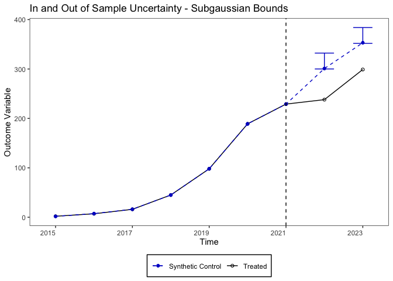<!-- -->

``` r
nobs45km <- as.numeric(c(res.pi$data$Y.pre[,1],
                                   res.pi$data$Y.post[,1],
                                   res.pi$est.results$Y.pre.fit[,1],
                                   res.pi$est.results$Y.post.fit[,1]))
year <- rep(2015:2023,2)
Treatment <- c(rep("Philadelphia",9), rep("Synthetic Control",9))

scpi.data <- tibble(nobs45km,year,Treatment)

(decline.2023 <- ((353.102 - 299)/349.839)*100)
```

    ## [1] 15.46483

``` r
(decline.2022 <- ((300.959 -238)/300.959)*100) 
```

    ## [1] 20.91946

GGplot of Scpi estimates

Creating Personal Theme

    ## Warning in geom_point(aes(x = 2022, y = 300.959, color = "#c443b2", group = 1)): All aesthetics have length 1, but the data has 18 rows.
    ## ℹ Please consider using `annotate()` or provide this layer with data containing
    ##   a single row.

    ## Warning in geom_point(aes(x = 2023, y = 353.102, color = "#c443b2", group = 1)): All aesthetics have length 1, but the data has 18 rows.
    ## ℹ Please consider using `annotate()` or provide this layer with data containing
    ##   a single row.

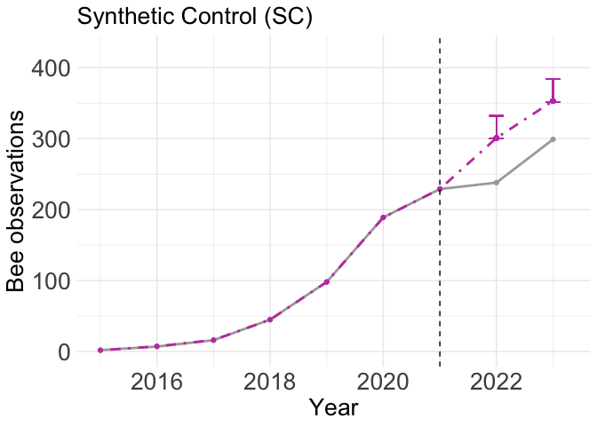<!-- -->
Scpi city weights plot

``` r
spci.weights.data <- data.frame(City = c("Chicago", "Raleigh","Tampa","Oakland","San Jose"), Weights = c(0.636, 0.179, 0.13,0.05, 0.005))

# Reorder city by weights
spci.weights.data$City <- factor(
  spci.weights.data$City,
  levels = spci.weights.data$City[order(spci.weights.data$Weights)])

scpi.weights.plot <- ggplot(spci.weights.data, aes(x = City, y = Weights))+
    geom_bar(stat = "identity")+
    coord_flip()+
    theme_minimal()+
    Asia_Theme
scpi.weights.plot
```

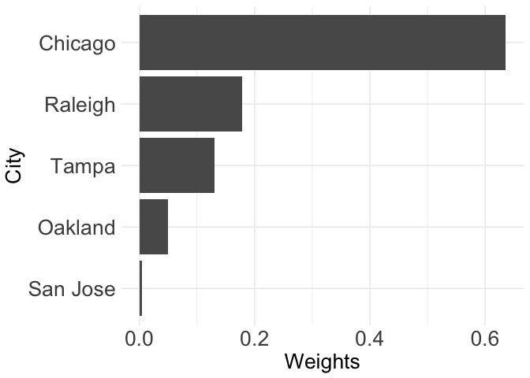<!-- -->

# Synthetic Control Analysis in tidysynth Package

## Creating the Synthetic Control

- Creating the control objects
- Selecting the predictors
- Generating weights

# Reload in the Data

``` r
city.data <- read.csv("data/cities.scm.input.csv")
```

Tidysynth

``` r
# Create synthetic control object
gbifcity_out <- city.data %>%
  # Initial synthetic control object
  synthetic_control(outcome = n.obs45km, # outcome
                    unit = City, # unit index in the panel data
                    time = year, # time index in the panel data
                    i_unit = "Philadelphia", # unit where the intervention occurred
                    i_time = 2021, # time period when the intervention occurred
                    generate_placebos = TRUE # generate placebo synthetic controls (for inference)
  ) %>%
  
  #Generate aggregate predictors to fit weights to each unit
  generate_predictor(time_window = 2015:2023,
                     Population = mean(Population, rm.na= TRUE),
                     "Unique Observers" = mean(unique_observers, rm.na = TRUE)
                     ) %>%

  generate_predictor(time_window = 2021,
                     "Temperature" = Temp,
                     "Precipitation" = Prec,
                     "Impervious surface" = imperv45km,
                     "Area (km2)" = area_km2,
                     "Median HH Income" = Median_HH_Income
                     ) %>%

  # Generate the fitted weights for the synthetic control
  generate_weights(optimization_window = 2015:2021, # time to use in the optimization task
                   margin_ipop = .02,sigf_ipop = 7,bound_ipop = 6 # optimizer options
  ) %>%
  
  # Generate the synthetic control
  generate_control()
```

## Visualizing the data

**Trends**: plot of trends of observed (treated) unit compared to
synthetic control over time, with dashed vertical line representing the
treatment event.

``` r
trendplot <- gbifcity_out %>% plot_trends()+
  Asia_Theme +
  labs(title = "Synthetic Control (SC)", caption = NULL,
        x = "Year",
        y = "Bee observations")+
    ylim(0,425)+
    xlim(2015,2023)+
    theme(legend.position = "none")
trendplot
```

    ## Warning: Removed 10 rows containing missing values or values outside the scale range
    ## (`geom_line()`).

    ## Warning: Removed 10 rows containing missing values or values outside the scale range
    ## (`geom_point()`).

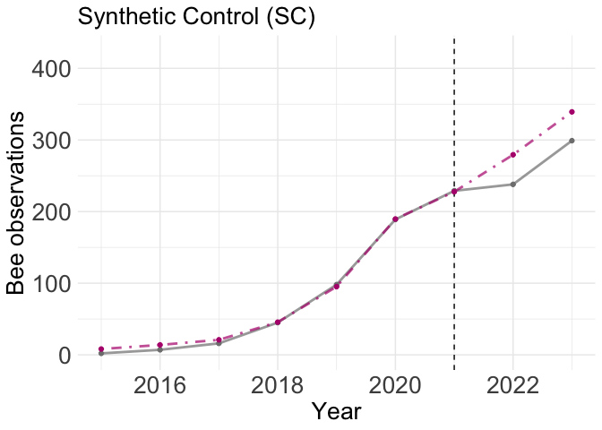<!-- -->

**Differences**: plot of difference in outcome variable between the
observed (treated) unit and the estimated outcome of the synthetic
control.

``` r
diffplot <- gbifcity_out %>% plot_differences()+
  Asia_Theme +
  labs(title = NULL, subtitle = NULL,
        x = "Year",
        y = "(Estimated - Observed) Bee observations")
```

**Weights**: Barplots showing the relative contributions (weights) of
each control unit and each predictor/variable unit to the synthetic
control.

``` r
weightplot <- gbifcity_out %>% plot_weights()+
  Asia_Theme +
  labs(title = NULL, subtitle = NULL,
       y = "Weight")
weightplot
```

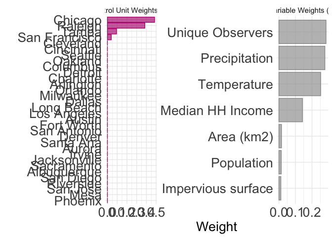<!-- -->

**Balance Table**: A table with values of the predictors/variables so
that you can see how similar the synthetic control is to observed
variables of the treated unit.

``` r
balancetab <- gbifcity_out %>% grab_balance_table() %>%
    mutate(synthetic_percent_diff = ((Philadelphia - synthetic_Philadelphia)/Philadelphia)*100,
           donor_percent_diff = ((Philadelphia - donor_sample)/Philadelphia)*100)
```

## Inference

**In-space placebos**: The same as difference plot above, this time
comparing each control unit to the synthetic control. This is to see if
the difference between the treated unit and the synthetic control
actually stands out as significantly greater.

``` r
placebos <- gbifcity_out %>% plot_placebos(prune = FALSE)+
  Asia_Theme +
  labs(title = NULL, subtitle = NULL,
        x = "Year",
        y = "(Estimated - Observed) Bee observations")
placebos
```

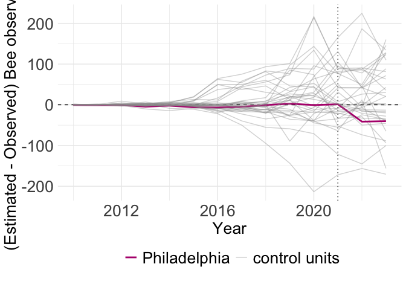<!-- -->

**Ratio of pre and post intervention period mean squared predictive
error (mspe)**

``` r
mpseratio <- gbifcity_out %>% plot_mspe_ratio()+
  Asia_Theme +
  labs(title = NULL, subtitle = NULL)
mpseratio
```

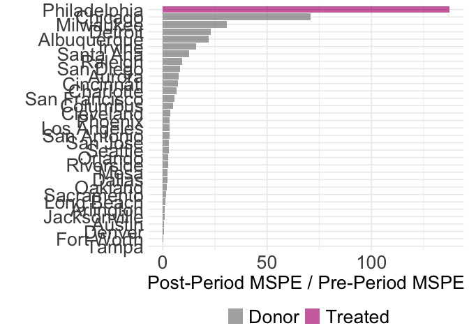<!-- -->

### Significance table

**Constructing Fisher’s Exact P-value**: This table takes the mspe ratio
and lists units in descending order. P-values are constructed by
dividing a units rank by the total. *You need at least 20 cases in the
unit pool to achieve a p-value below .05*

``` r
significance.tab <- gbifcity_out %>% grab_significance()
significance.tab <- as.data.frame(significance.tab)
significance.tab
```

    ##        unit_name    type   pre_mspe    post_mspe   mspe_ratio rank
    ## 1   Philadelphia Treated   12.10470  1663.429993 137.42012605    1
    ## 2        Chicago   Donor  372.50185 26438.405709  70.97523353    2
    ## 3      Milwaukee   Donor  419.87249 12823.480224  30.54136765    3
    ## 4        Detroit   Donor  535.57281 12239.162852  22.85247241    4
    ## 5    Albuquerque   Donor  144.33975  3153.251290  21.84603581    5
    ## 6         Irvine   Donor  213.50447  3412.035446  15.98109604    6
    ## 7      Santa Ana   Donor  836.50392 10637.013162  12.71603509    7
    ## 8        Raleigh   Donor 1288.26569 11811.773560   9.16874028    8
    ## 9      San Diego   Donor 1080.63094  9021.051736   8.34794875    9
    ## 10        Aurora   Donor  147.54685  1143.668228   7.75122097   10
    ## 11    Cincinnati   Donor 4227.98961 31269.022582   7.39571888   11
    ## 12     Charlotte   Donor 2341.51374 15550.207898   6.64109188   12
    ## 13 San Francisco   Donor  110.64308   613.758882   5.54719643   13
    ## 14      Columbus   Donor 1325.37328  6616.191629   4.99194584   14
    ## 15     Cleveland   Donor 1307.71025  4808.843700   3.67730062   15
    ## 16       Phoenix   Donor   91.62956   303.704454   3.31448106   16
    ## 17   Los Angeles   Donor 1713.36867  5669.627980   3.30905314   17
    ## 18   San Antonio   Donor  281.82596   915.427073   3.24819992   18
    ## 19      San Jose   Donor  746.86540  2281.991749   3.05542573   19
    ## 20       Seattle   Donor 8988.30636 26766.891825   2.97796835   20
    ## 21       Orlando   Donor   58.68546   159.563438   2.71896020   21
    ## 22     Riverside   Donor 1886.88239  4762.949453   2.52424288   22
    ## 23          Mesa   Donor  429.60967   951.767334   2.21542346   23
    ## 24        Dallas   Donor 5567.16049 12018.598696   2.15883820   24
    ## 25       Oakland   Donor  401.90863   803.030125   1.99804151   25
    ## 26    Sacramento   Donor 2996.24171  4753.631232   1.58653129   26
    ## 27    Long Beach   Donor  609.53663   810.158443   1.32913823   27
    ## 28     Arlington   Donor 6909.27881  7416.046760   1.07334600   28
    ## 29  Jacksonville   Donor  342.66295   280.503671   0.81859937   29
    ## 30        Austin   Donor  315.65462   238.764538   0.75641072   30
    ## 31        Denver   Donor   36.67228    21.238956   0.57915567   31
    ## 32    Fort Worth   Donor 3322.37004  1090.484921   0.32822500   32
    ## 33         Tampa   Donor  337.47650     5.690512   0.01686195   33
    ##    fishers_exact_pvalue     z_score
    ## 1            0.03030303  4.79053990
    ## 2            0.06060606  2.25024399
    ## 3            0.09090909  0.70439177
    ## 4            0.12121212  0.41043285
    ## 5            0.15151515  0.37195514
    ## 6            0.18181818  0.14772899
    ## 7            0.21212121  0.02290042
    ## 8            0.24242424 -0.11271841
    ## 9            0.27272727 -0.14409860
    ## 10           0.30303030 -0.16691247
    ## 11           0.33333333 -0.18050389
    ## 12           0.36363636 -0.20935450
    ## 13           0.39393939 -0.25117590
    ## 14           0.42424242 -0.27240403
    ## 15           0.45454545 -0.32266504
    ## 16           0.48484848 -0.33653622
    ## 17           0.51515152 -0.33674374
    ## 18           0.54545455 -0.33907026
    ## 19           0.57575758 -0.34644033
    ## 20           0.60606061 -0.34940165
    ## 21           0.63636364 -0.35930395
    ## 22           0.66666667 -0.36674831
    ## 23           0.69696970 -0.37855498
    ## 24           0.72727273 -0.38071832
    ## 25           0.75757576 -0.38686584
    ## 26           0.78787879 -0.40259854
    ## 27           0.81818182 -0.41243910
    ## 28           0.84848485 -0.42221845
    ## 29           0.87878788 -0.43195783
    ## 30           0.90909091 -0.43433540
    ## 31           0.93939394 -0.44111215
    ## 32           0.96969697 -0.45070563
    ## 33           1.00000000 -0.46260955

# Other Approaches

## Before-After (BA) Analysis w/ only Philadelphia

``` r
#Create relevant dummy variables
city.data.ba <- city.data %>%
    filter(City == "Philadelphia" & year > 2018)%>%
    mutate(Treatment = ifelse(year > 2021,1,0))

#ba.model <- feols(nobs45km ~ Treatment, data = city.data.ba, cluster = ~City)

ba.model <- lm(n.obs45km ~ Treatment, data = city.data.ba)
summary(ba.model)
```

    ## 
    ## Call:
    ## lm(formula = n.obs45km ~ Treatment, data = city.data.ba)
    ## 
    ## Residuals:
    ##     1     2     3     4     5 
    ## -74.0  17.0  57.0 -30.5  30.5 
    ## 
    ## Coefficients:
    ##             Estimate Std. Error t value Pr(>|t|)  
    ## (Intercept)   172.00      34.76   4.948   0.0158 *
    ## Treatment      96.50      54.96   1.756   0.1774  
    ## ---
    ## Signif. codes:  0 '***' 0.001 '**' 0.01 '*' 0.05 '.' 0.1 ' ' 1
    ## 
    ## Residual standard error: 60.21 on 3 degrees of freedom
    ## Multiple R-squared:  0.5068, Adjusted R-squared:  0.3424 
    ## F-statistic: 3.083 on 1 and 3 DF,  p-value: 0.1774

``` r
confint.ba <- confint(ba.model)
confint.ba
```

    ##                 2.5 %   97.5 %
    ## (Intercept)  61.37724 282.6228
    ## Treatment   -78.40994 271.4099

*BA plot with most similar city*

``` r
city.avg.ba <- city.data.ba %>%
  mutate(period = ifelse(year > 2021, "post", "pre")) %>%
  group_by(period) %>%
  summarise(n.obs45km = mean(n.obs45km, na.rm = TRUE))

ba.plot <- ggplot(city.data.ba, aes(x = year, y = n.obs45km)) +
    geom_point(linewidth = 1, color = "darkgrey")+
  geom_point(color = "darkgrey")+
    geom_point(aes(x = 2020, y = ba.model$coefficients[1], color = "#8B0000", group = 1))+
        geom_errorbar(aes(x = 2020, ymin = 0, ymax = confint.ba[3], color = "#8B0000"), width = 0.25)+
    geom_point(aes(x = 2022, y = ( ba.model$coefficients[1] + ba.model$coefficients[2]), color = "#8B0000", group = 1))+
    geom_errorbar(aes(x = 2022, ymin = ( ba.model$coefficients[1] + confint.ba[2]), ymax = ( ba.model$coefficients[1] + confint.ba[4]), color = "#8B0000"), width = 0.25)+
    geom_segment(aes(x = 2019, xend = 2021, y = city.avg.ba$n.obs45km[city.avg.ba$period == "pre"], yend = city.avg.ba$n.obs45km[city.avg.ba$period == "pre"]),color = "darkgrey", size = 1, linetype="dashed")+
        geom_segment(aes(x = 2021, xend = 2023, y = city.avg.ba$n.obs45km[city.avg.ba$period == "post"], yend = city.avg.ba$n.obs45km[city.avg.ba$period == "post"]),color = "darkgrey", size = 1, linetype="dashed")+
  geom_vline(xintercept = 2021, linetype="dashed")+
    scale_x_continuous(
      limits = c(2015, 2023),         # restrict x-axis range
      breaks = c(2018, 2022.5),       # positions for labels (midpoints of pre/post)
      labels = c("pre", "post")       # labels for those positions
    ) +
  labs(title = "Before-After (BA)",
       x = "Period",
       y = "Bee observations") +
  theme_minimal()+
  theme(legend.position = "none")+
  Asia_Theme+
    ylim(0,450)
ba.plot
```

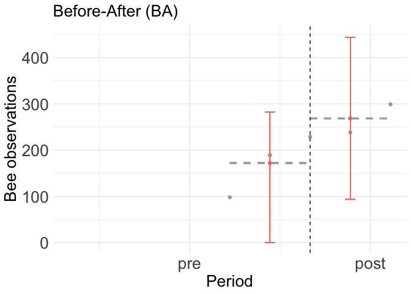<!-- -->
\## Before- After Control Impact (BACI) Analysis w/ closest city with
similar population size (naive selection)

``` r
#Creating the relevant dummy variables
city.data.baci <- city.data %>%
  mutate(Time = ifelse(year > 2021, 1, 0)) %>%
  mutate(Treated = if_else(City == "Philadelphia",1,0))%>%
    filter(City == "Philadelphia" | City == "Detroit")%>%
    filter(year > 2018)

#Test for parallel trends
pre.data <- city.data.baci %>% filter(year <= 2021)
pre.slope.model <- lm(n.obs45km ~ Treated * year, data = pre.data)
summary(pre.slope.model)
```

    ## 
    ## Call:
    ## lm(formula = n.obs45km ~ Treated * year, data = pre.data)
    ## 
    ## Residuals:
    ##      1      2      3      4      5      6 
    ## -2.667  5.333 -2.667 -8.500 17.000 -8.500 
    ## 
    ## Coefficients:
    ##               Estimate Std. Error t value Pr(>|t|)  
    ## (Intercept)  -66612.33   22039.46  -3.022   0.0942 .
    ## Treated      -65525.67   31168.50  -2.102   0.1703  
    ## year             33.00      10.91   3.025   0.0941 .
    ## Treated:year     32.50      15.43   2.106   0.1698  
    ## ---
    ## Signif. codes:  0 '***' 0.001 '**' 0.01 '*' 0.05 '.' 0.1 ' ' 1
    ## 
    ## Residual standard error: 15.43 on 2 degrees of freedom
    ## Multiple R-squared:  0.9862, Adjusted R-squared:  0.9654 
    ## F-statistic: 47.53 on 3 and 2 DF,  p-value: 0.02068

``` r
#Running the Before- After Control Impact model
#baci.model <- feols(nobs45km ~ Treated * Time, data = city.data.baci, cluster = ~City)
baci.model <- lm(n.obs45km ~ Treated * Time, data = city.data.baci)

summary(baci.model)
```

    ## 
    ## Call:
    ## lm(formula = n.obs45km ~ Treated * Time, data = city.data.baci)
    ## 
    ## Residuals:
    ##     Min      1Q  Median      3Q     Max 
    ## -74.000 -26.125   9.167  27.000  57.000 
    ## 
    ## Coefficients:
    ##              Estimate Std. Error t value Pr(>|t|)  
    ## (Intercept)     47.67      27.32   1.745   0.1316  
    ## Treated        124.33      38.63   3.218   0.0182 *
    ## Time            62.33      43.19   1.443   0.1991  
    ## Treated:Time    34.17      61.09   0.559   0.5962  
    ## ---
    ## Signif. codes:  0 '***' 0.001 '**' 0.01 '*' 0.05 '.' 0.1 ' ' 1
    ## 
    ## Residual standard error: 47.32 on 6 degrees of freedom
    ## Multiple R-squared:  0.8253, Adjusted R-squared:  0.7379 
    ## F-statistic: 9.446 on 3 and 6 DF,  p-value: 0.01088

``` r
confint.baci <- confint(baci.model)
confint.baci
```

    ##                   2.5 %   97.5 %
    ## (Intercept)   -19.17869 114.5120
    ## Treated        29.79972 218.8669
    ## Time          -43.35846 168.0251
    ## Treated:Time -115.30410 183.6374

*BACI plot with most similar city*

``` r
baci.plot <- ggplot(city.data.baci, aes(x = year, y = n.obs45km, color = City)) +
  geom_point()+
    geom_smooth(data = subset(city.data.baci,Time == 0 & Treated == 1),
                method = "lm", se = FALSE)+
        geom_smooth(data = subset(city.data.baci,year >= 2021 & Treated == 1),
                method = "lm", se = FALSE)+
        geom_smooth(data = subset(city.data.baci,Time == 0 & Treated == 0),
                method = "lm", se = FALSE)+
        geom_smooth(data = subset(city.data.baci,year >= 2021 & Treated == 0),
                method = "lm", se = FALSE)+
  scale_linetype_manual(values=c(3,1))+
  scale_color_manual(values=c('#332288','darkgrey'))+
  geom_vline(xintercept = 2021, linetype="dashed")+
  labs(title = "Before-After Control Impact (BACI)",
       x = "Year",
       y = "Bee observations") +
  theme_minimal()+
  theme(legend.position = "none")+
  Asia_Theme+
    ylim(0,425)+
    xlim(2015,2023)
baci.plot
```

    ## `geom_smooth()` using formula = 'y ~ x'
    ## `geom_smooth()` using formula = 'y ~ x'
    ## `geom_smooth()` using formula = 'y ~ x'
    ## `geom_smooth()` using formula = 'y ~ x'

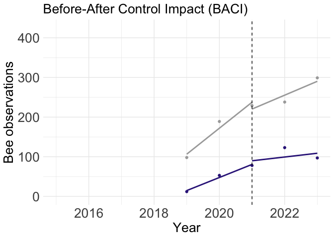<!-- -->

BACI with the full pre-treatement era (parallel trends assumption not
met)

``` r
#Creating the relevant dummy variables
city.data.baci <- city.data %>%
  mutate(Time = ifelse(year > 2021, 1, 0)) %>%
  mutate(Treated = if_else(City == "Philadelphia",1,0))%>%
    filter(City == "Philadelphia" | City == "Detroit")

pre.data <- city.data.baci %>% filter(year <= 2021)
pre.slope.model <- lm(n.obs45km ~ Treated * year, data = pre.data)
summary(pre.slope.model)
```

    ## 
    ## Call:
    ## lm(formula = n.obs45km ~ Treated * year, data = pre.data)
    ## 
    ## Residuals:
    ##     Min      1Q  Median      3Q     Max 
    ## -60.329 -18.512  -5.064  14.898  80.462 
    ## 
    ## Coefficients:
    ##                Estimate Std. Error t value Pr(>|t|)   
    ## (Intercept)  -10275.249   6260.703  -1.641  0.11638   
    ## Treated      -26060.209   8853.971  -2.943  0.00804 **
    ## year              5.105      3.106   1.643  0.11593   
    ## Treated:year     12.948      4.393   2.947  0.00796 **
    ## ---
    ## Signif. codes:  0 '***' 0.001 '**' 0.01 '*' 0.05 '.' 0.1 ' ' 1
    ## 
    ## Residual standard error: 37.15 on 20 degrees of freedom
    ## Multiple R-squared:  0.6773, Adjusted R-squared:  0.6289 
    ## F-statistic: 13.99 on 3 and 20 DF,  p-value: 3.806e-05

``` r
#Running the Before- After Control Impact model
#baci.model <- feols(nobs45km ~ Treated * Time, data = city.data.baci, cluster = ~City)
baci.model.2 <- lm(n.obs45km ~ Treated * Time, data = city.data.baci)

summary(baci.model.2)
```

    ## 
    ## Call:
    ## lm(formula = n.obs45km ~ Treated * Time, data = city.data.baci)
    ## 
    ## Residuals:
    ##    Min     1Q Median     3Q    Max 
    ## -49.25 -35.50 -12.83   2.00 179.75 
    ## 
    ## Coefficients:
    ##              Estimate Std. Error t value Pr(>|t|)  
    ## (Intercept)     13.67      16.68   0.819   0.4206  
    ## Treated         35.58      23.59   1.509   0.1445  
    ## Time            96.33      44.13   2.183   0.0391 *
    ## Treated:Time   122.92      62.41   1.970   0.0605 .
    ## ---
    ## Signif. codes:  0 '***' 0.001 '**' 0.01 '*' 0.05 '.' 0.1 ' ' 1
    ## 
    ## Residual standard error: 57.78 on 24 degrees of freedom
    ## Multiple R-squared:  0.5958, Adjusted R-squared:  0.5452 
    ## F-statistic: 11.79 on 3 and 24 DF,  p-value: 6.073e-05

``` r
confint.baci.2 <- confint(baci.model.2)
confint.baci.2
```

    ##                   2.5 %   97.5 %
    ## (Intercept)  -20.758166  48.0915
    ## Treated      -13.100732  84.2674
    ## Time           5.253788 187.4129
    ## Treated:Time  -5.889262 251.7226

*BACI plot with the full pre-treatment era (parallel trends assumption
not met)*

``` r
baci.plot.2 <- ggplot(city.data.baci, aes(x = year, y = n.obs45km, color = City)) +
  geom_point()+
    geom_smooth(data = subset(city.data.baci,Time == 0 & Treated == 1),
                method = "lm", se = FALSE)+
        geom_smooth(data = subset(city.data.baci,year >= 2021 & Treated == 1),
                method = "lm", se = FALSE)+
        geom_smooth(data = subset(city.data.baci,Time == 0 & Treated == 0),
                method = "lm", se = FALSE)+
        geom_smooth(data = subset(city.data.baci,year >= 2021 & Treated == 0),
                method = "lm", se = FALSE)+
  scale_linetype_manual(values=c(3,1))+
  scale_color_manual(values=c('#332288','darkgrey'))+
  geom_vline(xintercept = 2021, linetype="dashed")+
  labs(title = "Before-After Control Impact (BACI)",
       x = "Year",
       y = "Bee observations") +
  theme_minimal()+
  Asia_Theme+
    ylim(0,425)+
    xlim(2015,2023)
baci.plot.2
```

    ## `geom_smooth()` using formula = 'y ~ x'
    ## `geom_smooth()` using formula = 'y ~ x'
    ## `geom_smooth()` using formula = 'y ~ x'
    ## `geom_smooth()` using formula = 'y ~ x'

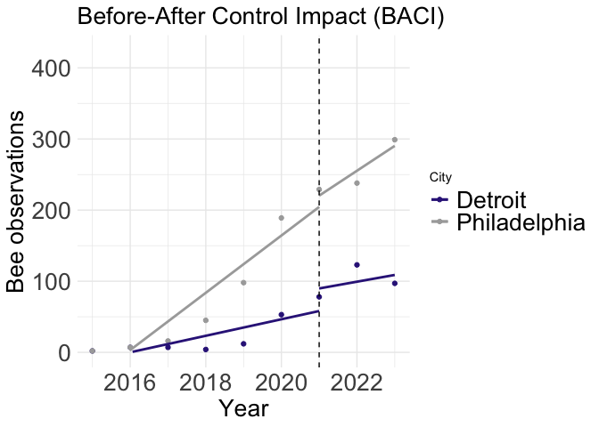<!-- -->

Before- After Control Impact (BACI) Analysis w/ Cleveland

``` r
#Creating the relevant dummy variables
city.data.baci.2 <- city.data %>%
  mutate(Time = ifelse(year > 2021, 1, 0)) %>%
  mutate(Treated = if_else(City == "Philadelphia",1,0))%>%
    filter(City == "Philadelphia" | City == "Cleveland")

#Running the Before- After Control Impact model
#baci.model <- feols(nobs45km ~ Treated * Time, data = city.data.baci, cluster = ~City)
baci.model.2 <- lm(n.obs45km ~ Treated * Time, data = city.data.baci.2)

summary(baci.model.2)
```

    ## 
    ## Call:
    ## lm(formula = n.obs45km ~ Treated * Time, data = city.data.baci.2)
    ## 
    ## Residuals:
    ##    Min     1Q Median     3Q    Max 
    ## -49.25 -45.50 -32.25  31.81 179.75 
    ## 
    ## Coefficients:
    ##              Estimate Std. Error t value Pr(>|t|)  
    ## (Intercept)     47.25      19.10   2.474   0.0208 *
    ## Treated          2.00      27.01   0.074   0.9416  
    ## Time            90.25      50.53   1.786   0.0868 .
    ## Treated:Time   129.00      71.47   1.805   0.0836 .
    ## ---
    ## Signif. codes:  0 '***' 0.001 '**' 0.01 '*' 0.05 '.' 0.1 ' ' 1
    ## 
    ## Residual standard error: 66.17 on 24 degrees of freedom
    ## Multiple R-squared:  0.4859, Adjusted R-squared:  0.4216 
    ## F-statistic:  7.56 on 3 and 24 DF,  p-value: 0.0009958

``` r
confint.baci.2 <- confint(baci.model.2)
confint.baci.2
```

    ##                   2.5 %    97.5 %
    ## (Intercept)    7.829121  86.67088
    ## Treated      -53.749542  57.74954
    ## Time         -14.047842 194.54784
    ## Treated:Time -18.499423 276.49942

``` r
#shows significant increases in Philadelphia bee abundance when compared to Detroit
```

*BACI plot with Cleveland*

``` r
palette.colors(palette = "Okabe-Ito")
```

    ## [1] "#000000" "#E69F00" "#56B4E9" "#009E73" "#F0E442" "#0072B2" "#D55E00"
    ## [8] "#CC79A7" "#999999"

``` r
baci.plot.2 <- ggplot(city.data.baci.2, aes(x = year, y = n.obs45km, color = City)) +
  geom_point()+
        geom_smooth(data = subset(city.data.baci.2,Time == 0 & Treated == 1),
                method = "lm", se = FALSE)+
        geom_smooth(data = subset(city.data.baci.2,year >= 2021 & Treated == 1),
                method = "lm", se = FALSE)+
        geom_smooth(data = subset(city.data.baci.2,Time == 0 & Treated == 0),
                method = "lm", se = FALSE)+
        geom_smooth(data = subset(city.data.baci.2,year >= 2021 & Treated == 0),
                method = "lm", se = FALSE)+
  scale_linetype_manual(values=c(3,1))+
  scale_color_manual(values=c('#D55E00','darkgrey'))+
  geom_vline(xintercept = 2021, linetype="dashed")+
  labs(title = "Before-After Control Impact (BACI)",
       x = "Year",
       y = "Bee observations") +
  theme_minimal()+
  Asia_Theme+
    ylim(0,425)+
    xlim(2015,2023)

baci.plot.2
```

    ## `geom_smooth()` using formula = 'y ~ x'
    ## `geom_smooth()` using formula = 'y ~ x'
    ## `geom_smooth()` using formula = 'y ~ x'
    ## `geom_smooth()` using formula = 'y ~ x'

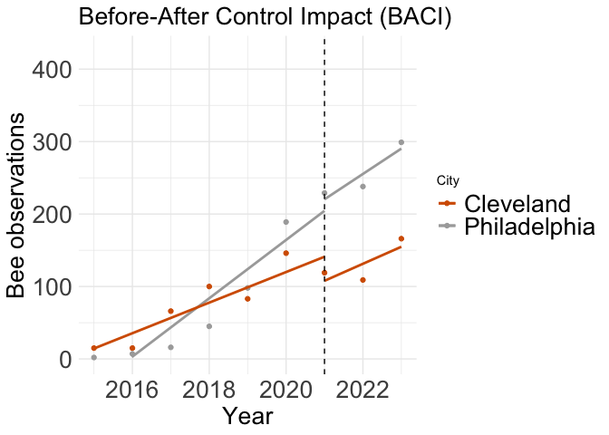<!-- -->

## Interrupted Time Series (ITS) Regression

Explanation of ITS modelling:
<https://rpubs.com/chrissyhroberts/1006858>

``` r
#Creating the relevant dummy variables in dataframe
city.data.its <- city.data %>%
  filter(City == "Philadelphia" & year >= 2015)%>%
  mutate(Treated = if_else(year > 2021, 1, 0))%>%
  mutate(Time_since= if_else(year <= 2021, 0, (year-2020)))
city.data.its
```

    ##           City State_Abbrev        State area_km2      Lat      Long  ID
    ## 1 Philadelphia           PA Pennsylvania      348 39.95258 -75.16522 249
    ## 2 Philadelphia           PA Pennsylvania      348 39.95258 -75.16522 249
    ## 3 Philadelphia           PA Pennsylvania      348 39.95258 -75.16522 249
    ## 4 Philadelphia           PA Pennsylvania      348 39.95258 -75.16522 249
    ## 5 Philadelphia           PA Pennsylvania      348 39.95258 -75.16522 249
    ## 6 Philadelphia           PA Pennsylvania      348 39.95258 -75.16522 249
    ## 7 Philadelphia           PA Pennsylvania      348 39.95258 -75.16522 249
    ## 8 Philadelphia           PA Pennsylvania      348 39.95258 -75.16522 249
    ## 9 Philadelphia           PA Pennsylvania      348 39.95258 -75.16522 249
    ##       Temp Prec   tcc45km imperv45km year Population n.obs45km unique_observers
    ## 1 12.74951 1141 252934612  127985949 2015    1571065         2              179
    ## 2 12.74951 1141 252934612  127985949 2016    1576051         7              434
    ## 3 12.74951 1141 252934612  127985949 2017    1580601        16              428
    ## 4 12.74951 1141 252934612  127985949 2018    1583592        45              721
    ## 5 12.74951 1141 252934612  127985949 2019    1584064        98             2399
    ## 6 12.74951 1141 252934612  127985949 2020    1600684       189             3774
    ## 7 12.74951 1141 252934612  127985949 2021    1589623       229             4697
    ## 8 12.74951 1141 252934612  127985949 2022    1566836       238             4516
    ## 9 12.74951 1141 252934612  127985949 2023    1550542       299             4736
    ##   Median_HH_Income PovertyIndex BA_Population MedianHomeValue Treated
    ## 1            85285          103        878518          319367       0
    ## 2            85285          103        878518          319367       0
    ## 3            85285          103        878518          319367       0
    ## 4            85285          103        878518          319367       0
    ## 5            85285          103        878518          319367       0
    ## 6            85285          103        878518          319367       0
    ## 7            85285          103        878518          319367       0
    ## 8            85285          103        878518          319367       1
    ## 9            85285          103        878518          319367       1
    ##   Time_since
    ## 1          0
    ## 2          0
    ## 3          0
    ## 4          0
    ## 5          0
    ## 6          0
    ## 7          0
    ## 8          2
    ## 9          3

``` r
#Running the its regression
its.model <- gls(n.obs45km ~ year + Treated + Time_since, data = city.data.its, correlation= corARMA(p=1, q=1, form = ~ year), method = "ML")
summary(its.model)
```

    ## Generalized least squares fit by maximum likelihood
    ##   Model: n.obs45km ~ year + Treated + Time_since 
    ##   Data: city.data.its 
    ##        AIC      BIC    logLik
    ##   91.60649 92.98706 -38.80325
    ## 
    ## Correlation Structure: ARMA(1,1)
    ##  Formula: ~year 
    ##  Parameter estimate(s):
    ##      Phi1    Theta1 
    ## 0.2316104 0.9999582 
    ## 
    ## Coefficients:
    ##                 Value Std.Error   t-value p-value
    ## (Intercept) -74968.68 15488.471 -4.840290  0.0047
    ## year            37.19     7.675  4.845942  0.0047
    ## Treated        -52.27    53.170 -0.983134  0.3707
    ## Time_since      25.74    30.498  0.844084  0.4371
    ## 
    ##  Correlation: 
    ##            (Intr) year   Treatd
    ## year       -1.000              
    ## Treated    -0.421  0.421       
    ## Time_since  0.626 -0.627 -0.888
    ## 
    ## Standardized residuals:
    ##         Min          Q1         Med          Q3         Max 
    ## -1.69982395 -1.06753167  0.02334903  1.04349177  1.19709440 
    ## 
    ## Residual standard error: 24.99896 
    ## Degrees of freedom: 9 total; 5 residual

``` r
#confidence intervals for the its regression
confint.its <- confint(its.model)
```

ITS Plot - making predictions

``` r
#Creating model for counterfactual
city.data.its.2 <-filter(city.data.its, year <= 2021)
its.counter = gls(n.obs45km ~ year, data = city.data.its.2, correlation= corARMA(p=1, q=1, form = ~ year),method="ML")

#Adding prediction intervals for counterfactual back to dataframe
city.data.its <-city.data.its %>% mutate(
  counter.predictions = predictSE.gls (its.counter, newdata = city.data.its, se.fit=T)$fit,
  counter.se = predictSE.gls (its.counter, city.data.its, se.fit=T)$se
)
```

Plot

``` r
its.plot <- ggplot(city.data.its,
         aes(x = year, y = n.obs45km))+
  geom_ribbon(aes(ymin = counter.predictions - (1.96*counter.se), ymax = counter.predictions + (1.96*counter.se)), fill = 'turquoise', alpha = .2, linetype = 2)+
  geom_line(aes(year,counter.predictions),color='turquoise', lty = 4)+
  geom_point(color = 'darkgrey')+
      scale_linetype_manual(values=1)+
        geom_smooth(data = subset(city.data.its, year <= 2021),
                method = "lm", se = FALSE, color = 'darkgrey')+
        geom_smooth(data = subset(city.data.its,year >= 2021),
                method = "lm", se = FALSE, color = 'darkgrey')+
    geom_vline(xintercept = 2021, linetype="dashed")+
    xlim(2015,2023)+
    ylim(0,425)+
      labs(title = "Interrupted Time Series (ITS)",
       x = "Year",
       y = "Bee observations")+
    theme_minimal()+
    Asia_Theme
its.plot
```

    ## `geom_smooth()` using formula = 'y ~ x'
    ## `geom_smooth()` using formula = 'y ~ x'

    ## Warning: Removed 1 row containing missing values or values outside the scale range
    ## (`geom_line()`).

    ## Warning: Removed 13 rows containing missing values or values outside the scale range
    ## (`geom_smooth()`).

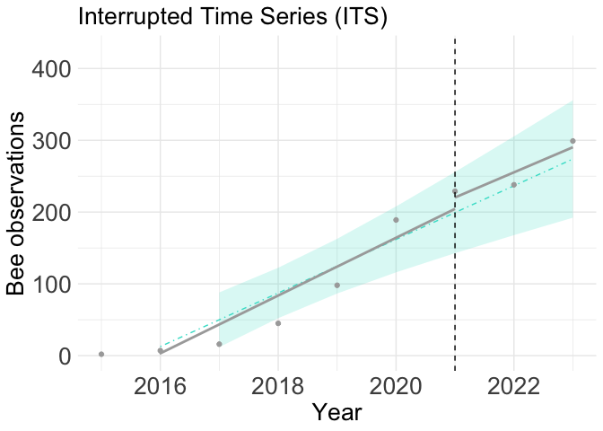<!-- -->

ITS for number of unique iNaturalist observers

``` r
#Creating the relevant dummy variables in dataframe
city.data.its.2 <- city.data %>%
  filter(City == "Philadelphia" & year >= 2015)%>%
  mutate(Treated = if_else(year > 2021, 1, 0))%>%
  mutate(Time_since= if_else(year <= 2021, 0, (year-2020)))
city.data.its.2
```

    ##           City State_Abbrev        State area_km2      Lat      Long  ID
    ## 1 Philadelphia           PA Pennsylvania      348 39.95258 -75.16522 249
    ## 2 Philadelphia           PA Pennsylvania      348 39.95258 -75.16522 249
    ## 3 Philadelphia           PA Pennsylvania      348 39.95258 -75.16522 249
    ## 4 Philadelphia           PA Pennsylvania      348 39.95258 -75.16522 249
    ## 5 Philadelphia           PA Pennsylvania      348 39.95258 -75.16522 249
    ## 6 Philadelphia           PA Pennsylvania      348 39.95258 -75.16522 249
    ## 7 Philadelphia           PA Pennsylvania      348 39.95258 -75.16522 249
    ## 8 Philadelphia           PA Pennsylvania      348 39.95258 -75.16522 249
    ## 9 Philadelphia           PA Pennsylvania      348 39.95258 -75.16522 249
    ##       Temp Prec   tcc45km imperv45km year Population n.obs45km unique_observers
    ## 1 12.74951 1141 252934612  127985949 2015    1571065         2              179
    ## 2 12.74951 1141 252934612  127985949 2016    1576051         7              434
    ## 3 12.74951 1141 252934612  127985949 2017    1580601        16              428
    ## 4 12.74951 1141 252934612  127985949 2018    1583592        45              721
    ## 5 12.74951 1141 252934612  127985949 2019    1584064        98             2399
    ## 6 12.74951 1141 252934612  127985949 2020    1600684       189             3774
    ## 7 12.74951 1141 252934612  127985949 2021    1589623       229             4697
    ## 8 12.74951 1141 252934612  127985949 2022    1566836       238             4516
    ## 9 12.74951 1141 252934612  127985949 2023    1550542       299             4736
    ##   Median_HH_Income PovertyIndex BA_Population MedianHomeValue Treated
    ## 1            85285          103        878518          319367       0
    ## 2            85285          103        878518          319367       0
    ## 3            85285          103        878518          319367       0
    ## 4            85285          103        878518          319367       0
    ## 5            85285          103        878518          319367       0
    ## 6            85285          103        878518          319367       0
    ## 7            85285          103        878518          319367       0
    ## 8            85285          103        878518          319367       1
    ## 9            85285          103        878518          319367       1
    ##   Time_since
    ## 1          0
    ## 2          0
    ## 3          0
    ## 4          0
    ## 5          0
    ## 6          0
    ## 7          0
    ## 8          2
    ## 9          3

``` r
#Running the its regression
its.model.2 <- gls(unique_observers ~ year + Treated + Time_since, data = city.data.its.2, correlation= corARMA(p=1, q=1, form = ~ year), method = "ML")
summary(its.model.2)
```

    ## Generalized least squares fit by maximum likelihood
    ##   Model: unique_observers ~ year + Treated + Time_since 
    ##   Data: city.data.its.2 
    ##        AIC      BIC    logLik
    ##   147.0403 148.4208 -66.52014
    ## 
    ## Correlation Structure: ARMA(1,1)
    ##  Formula: ~year 
    ##  Parameter estimate(s):
    ##      Phi1    Theta1 
    ## 0.3750419 0.7281371 
    ## 
    ## Coefficients:
    ##                  Value Std.Error   t-value p-value
    ## (Intercept) -1538604.0  352681.0 -4.362594  0.0073
    ## year             763.4     174.8  4.368268  0.0072
    ## Treated         -286.5    1177.8 -0.243281  0.8175
    ## Time_since      -311.3     663.2 -0.469477  0.6585
    ## 
    ##  Correlation: 
    ##            (Intr) year   Treatd
    ## year       -1.000              
    ## Treated    -0.417  0.417       
    ## Time_since  0.615 -0.616 -0.889
    ## 
    ## Standardized residuals:
    ##        Min         Q1        Med         Q3        Max 
    ## -2.2652869 -0.6455819  0.2466689  0.6577102  0.8309476 
    ## 
    ## Residual standard error: 564.6515 
    ## Degrees of freedom: 9 total; 5 residual

``` r
#confidence intervals for the its regression
confint.its.2 <- confint(its.model.2)
```

\#Confidence Intervals

Confidence interval plot for effect sizes in 2022 for all approaches

``` r
#Put coefficient and confidence interval estimates in single dataframe
method <- c("BA","BACI","ITS")
Estimate <- c(ba.model$coefficients[2],baci.model$coefficients[4],its.model$coefficients[3])
lwrCI <- c(confint.ba[2],confint.baci[4],confint.its[3]) #replace SCM CI
uprCI <- c(confint.ba[4],confint.baci[8],confint.its[7])
ci.data <- tibble(method,Estimate,lwrCI,uprCI)
```

CI Forest plot - Alternative methods

``` r
ci.plot <- ggplot(ci.data,
       aes(x = Estimate, y = method))+
    geom_errorbar(
        aes(xmin = lwrCI, xmax = uprCI), width = 0.25)+
    geom_point(size = 2.5)+
    geom_vline(xintercept = 0, linetype = 7)+
    xlim(-160,350)+
    theme_minimal()+
    Asia_Theme+
    theme(axis.title.y = element_blank())
ci.plot
```

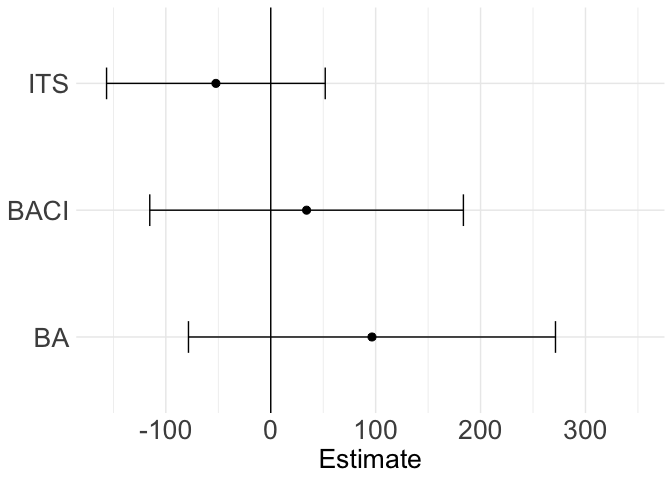<!-- -->

CI plot - synthetic control method (2023 estimate)

``` r
method <- c("SC 2023", "SC 2022")
Estimate <- c(299 - 353.102, 238 - 300.959) 
lwrCI <- c(299 - 383.925, 238 - 332.248)
uprCI <- c(299 - 351.842, 238 - 300.118)
scm.ci.data <- tibble(method,Estimate,lwrCI,uprCI)

scm.ci.plot <- ggplot(scm.ci.data,
       aes(x = Estimate, y = method))+
    geom_errorbar(
        aes(xmin = lwrCI, xmax = uprCI), width = 0.25)+
    geom_point(size = 2.5)+
    geom_vline(xintercept = 0, linetype = 7)+
    xlim(-130,350)+
    theme_minimal()+
    Asia_Theme+
    theme(axis.title.y = element_blank())
scm.ci.plot
```

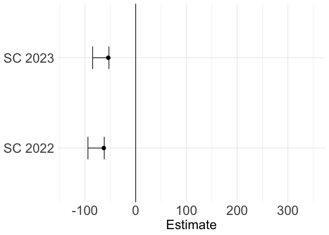<!-- -->

# Save Figures

``` r
trends.figure <- ggarrange(its.plot,baci.plot,ba.plot,ci.plot,scpi.plot,scm.ci.plot,
                    labels = c("A","B","C","D","E","F"), nrow = 3, ncol = 2)
```

    ## `geom_smooth()` using formula = 'y ~ x'
    ## `geom_smooth()` using formula = 'y ~ x'
    ## `geom_smooth()` using formula = 'y ~ x'
    ## `geom_smooth()` using formula = 'y ~ x'
    ## `geom_smooth()` using formula = 'y ~ x'
    ## `geom_smooth()` using formula = 'y ~ x'

``` r
ggsave("figures/BACIplot_Cleveland.png", plot = baci.plot.2)
```

    ## Saving 7 x 5 in image
    ## `geom_smooth()` using formula = 'y ~ x'
    ## `geom_smooth()` using formula = 'y ~ x'
    ## `geom_smooth()` using formula = 'y ~ x'
    ## `geom_smooth()` using formula = 'y ~ x'

``` r
ggsave("figures/Difference plot.png", plot = diffplot)
```

    ## Saving 7 x 5 in image

``` r
ggsave("figures/Weight plot.png", plot = weightplot, height = 12, width = 13)
ggsave("figures/Scpi Weights plot.png", plot = scpi.weights.plot)
```

    ## Saving 7 x 5 in image

``` r
ggsave("figures/Placebos plot.png", plot = placebos)
```

    ## Saving 7 x 5 in image

``` r
ggsave("figures/MPSE ratio plot.png", plot = mpseratio)
```

    ## Saving 7 x 5 in image

``` r
ggsave("figures/Method comparison plot.png", plot = trends.figure, height = 12, width = 11)
```

# Citations

``` r
citation()
```

    ## To cite R in publications use:
    ## 
    ##   R Core Team (2025). _R: A Language and Environment for Statistical
    ##   Computing_. R Foundation for Statistical Computing, Vienna, Austria.
    ##   <https://www.R-project.org/>.
    ## 
    ## A BibTeX entry for LaTeX users is
    ## 
    ##   @Manual{,
    ##     title = {R: A Language and Environment for Statistical Computing},
    ##     author = {{R Core Team}},
    ##     organization = {R Foundation for Statistical Computing},
    ##     address = {Vienna, Austria},
    ##     year = {2025},
    ##     url = {https://www.R-project.org/},
    ##   }
    ## 
    ## We have invested a lot of time and effort in creating R, please cite it
    ## when using it for data analysis. See also 'citation("pkgname")' for
    ## citing R packages.

``` r
devtools::session_info()
```

    ## ─ Session info ───────────────────────────────────────────────────────────────
    ##  setting  value
    ##  version  R version 4.4.3 (2025-02-28)
    ##  os       macOS Sequoia 15.7.2
    ##  system   aarch64, darwin20
    ##  ui       X11
    ##  language (EN)
    ##  collate  en_US.UTF-8
    ##  ctype    en_US.UTF-8
    ##  tz       America/Denver
    ##  date     2025-12-18
    ##  pandoc   3.2 @ /Applications/RStudio.app/Contents/Resources/app/quarto/bin/tools/aarch64/ (via rmarkdown)
    ##  quarto   1.5.57 @ /Applications/RStudio.app/Contents/Resources/app/quarto/bin/quarto
    ## 
    ## ─ Packages ───────────────────────────────────────────────────────────────────
    ##  package      * version    date (UTC) lib source
    ##  abind          1.4-8      2024-09-12 [1] CRAN (R 4.4.1)
    ##  AICcmodavg   * 2.3-4      2025-03-06 [1] CRAN (R 4.4.1)
    ##  backports      1.5.0      2024-05-23 [1] CRAN (R 4.4.1)
    ##  bit            4.6.0      2025-03-06 [1] CRAN (R 4.4.1)
    ##  bit64          4.6.0-1    2025-01-16 [1] CRAN (R 4.4.1)
    ##  boot           1.3-31     2024-08-28 [1] CRAN (R 4.4.3)
    ##  broom          1.0.7      2024-09-26 [1] CRAN (R 4.4.1)
    ##  cachem         1.1.0      2024-05-16 [1] CRAN (R 4.4.1)
    ##  car            3.1-3      2024-09-27 [1] CRAN (R 4.4.1)
    ##  carData        3.0-5      2022-01-06 [1] CRAN (R 4.4.1)
    ##  cli            3.6.4      2025-02-13 [1] CRAN (R 4.4.1)
    ##  coda           0.19-4.1   2024-01-31 [1] CRAN (R 4.4.1)
    ##  codetools      0.2-20     2024-03-31 [1] CRAN (R 4.4.3)
    ##  colorspace     2.1-1      2024-07-26 [1] CRAN (R 4.4.1)
    ##  conquer        1.3.3      2023-03-06 [1] CRAN (R 4.4.0)
    ##  corpcor        1.6.10     2021-09-16 [1] CRAN (R 4.4.1)
    ##  cowplot        1.1.3      2024-01-22 [1] CRAN (R 4.4.0)
    ##  cubature       2.1.4      2025-06-02 [1] CRAN (R 4.4.1)
    ##  CVXR           1.0-15     2024-11-07 [1] CRAN (R 4.4.1)
    ##  data.table   * 1.17.8     2025-07-10 [1] CRAN (R 4.4.1)
    ##  devtools       2.4.5      2022-10-11 [1] CRAN (R 4.4.0)
    ##  digest         0.6.37     2024-08-19 [1] CRAN (R 4.4.1)
    ##  doSNOW         1.0.20     2022-02-04 [1] CRAN (R 4.4.0)
    ##  dplyr        * 1.1.4      2023-11-17 [1] CRAN (R 4.4.0)
    ##  dreamerr       1.5.0      2025-04-18 [1] CRAN (R 4.4.1)
    ##  ECOSolveR      0.5.5      2023-05-15 [1] CRAN (R 4.4.1)
    ##  ellipsis       0.3.2      2021-04-29 [1] CRAN (R 4.4.1)
    ##  emmeans        1.11.0     2025-03-20 [1] CRAN (R 4.4.1)
    ##  estimability   1.5.1      2024-05-12 [1] CRAN (R 4.4.1)
    ##  evaluate       1.0.3      2025-01-10 [1] CRAN (R 4.4.1)
    ##  farver         2.1.2      2024-05-13 [1] CRAN (R 4.4.1)
    ##  fastDummies    1.7.5      2025-01-20 [1] CRAN (R 4.4.1)
    ##  fastmap        1.2.0      2024-05-15 [1] CRAN (R 4.4.1)
    ##  fixest       * 0.13.2     2025-09-08 [1] CRAN (R 4.4.1)
    ##  forcats      * 1.0.0      2023-01-29 [1] CRAN (R 4.4.0)
    ##  foreach        1.5.2      2022-02-02 [1] CRAN (R 4.4.0)
    ##  Formula        1.2-5      2023-02-24 [1] CRAN (R 4.4.1)
    ##  fs             1.6.5      2024-10-30 [1] CRAN (R 4.4.1)
    ##  generics       0.1.3      2022-07-05 [1] CRAN (R 4.4.1)
    ##  ggplot2      * 3.5.1      2024-04-23 [1] CRAN (R 4.4.0)
    ##  ggpubr       * 0.6.0      2023-02-10 [1] CRAN (R 4.4.0)
    ##  ggsignif       0.6.4      2022-10-13 [1] CRAN (R 4.4.0)
    ##  glmx           0.2-1      2024-09-04 [1] CRAN (R 4.4.1)
    ##  glue           1.8.0      2024-09-30 [1] CRAN (R 4.4.1)
    ##  gmp            0.7-5      2024-08-23 [1] CRAN (R 4.4.1)
    ##  gtable         0.3.6      2024-10-25 [1] CRAN (R 4.4.1)
    ##  gtools         3.9.5      2023-11-20 [1] CRAN (R 4.4.1)
    ##  hms            1.1.3      2023-03-21 [1] CRAN (R 4.4.0)
    ##  htmltools      0.5.8.1    2024-04-04 [1] CRAN (R 4.4.1)
    ##  htmlwidgets    1.6.4      2023-12-06 [1] CRAN (R 4.4.0)
    ##  httpuv         1.6.16     2025-04-16 [1] CRAN (R 4.4.1)
    ##  iterators      1.0.14     2022-02-05 [1] CRAN (R 4.4.1)
    ##  kernlab        0.9-33     2024-08-13 [1] CRAN (R 4.4.1)
    ##  knitr          1.49       2024-11-08 [1] CRAN (R 4.4.1)
    ##  labeling       0.4.3      2023-08-29 [1] CRAN (R 4.4.1)
    ##  later          1.4.1      2024-11-27 [1] CRAN (R 4.4.1)
    ##  lattice        0.22-6     2024-03-20 [1] CRAN (R 4.4.3)
    ##  lifecycle      1.0.4      2023-11-07 [1] CRAN (R 4.4.1)
    ##  lme4         * 1.1-36     2025-01-11 [1] CRAN (R 4.4.1)
    ##  lmerTest     * 3.1-3      2020-10-23 [1] CRAN (R 4.4.0)
    ##  lmtest         0.9-40     2022-03-21 [1] CRAN (R 4.4.1)
    ##  lubridate    * 1.9.4      2024-12-08 [1] CRAN (R 4.4.1)
    ##  magrittr       2.0.3      2022-03-30 [1] CRAN (R 4.4.1)
    ##  MASS           7.3-64     2025-01-04 [1] CRAN (R 4.4.3)
    ##  Matrix       * 1.7-2      2025-01-23 [1] CRAN (R 4.4.3)
    ##  MatrixModels   0.5-3      2023-11-06 [1] CRAN (R 4.4.0)
    ##  matrixStats    1.5.0      2025-01-07 [1] CRAN (R 4.4.1)
    ##  memoise        2.0.1      2021-11-26 [1] CRAN (R 4.4.0)
    ##  mgcv           1.9-1      2023-12-21 [1] CRAN (R 4.4.3)
    ##  microsynth   * 2.0.51     2025-04-25 [1] CRAN (R 4.4.1)
    ##  mime           0.12       2021-09-28 [1] CRAN (R 4.4.1)
    ##  miniUI         0.1.2      2025-04-17 [1] CRAN (R 4.4.1)
    ##  minqa          1.2.8      2024-08-17 [1] CRAN (R 4.4.1)
    ##  munsell        0.5.1      2024-04-01 [1] CRAN (R 4.4.1)
    ##  mvtnorm        1.3-3      2025-01-10 [1] CRAN (R 4.4.1)
    ##  nlme         * 3.1-167    2025-01-27 [1] CRAN (R 4.4.3)
    ##  nloptr         2.2.1      2025-03-17 [1] CRAN (R 4.4.1)
    ##  np             0.60-18    2024-12-10 [1] CRAN (R 4.4.1)
    ##  numDeriv       2016.8-1.1 2019-06-06 [1] CRAN (R 4.4.1)
    ##  optimx         2025-4.9   2025-04-10 [1] CRAN (R 4.4.1)
    ##  pillar         1.10.1     2025-01-07 [1] CRAN (R 4.4.1)
    ##  pkgbuild       1.4.8      2025-05-26 [1] CRAN (R 4.4.1)
    ##  pkgconfig      2.0.3      2019-09-22 [1] CRAN (R 4.4.1)
    ##  pkgload        1.4.0      2024-06-28 [1] CRAN (R 4.4.0)
    ##  plyr           1.8.9      2023-10-02 [1] CRAN (R 4.4.1)
    ##  pracma         2.4.4      2023-11-10 [1] CRAN (R 4.4.1)
    ##  profvis        0.4.0      2024-09-20 [1] CRAN (R 4.4.1)
    ##  promises       1.3.2      2024-11-28 [1] CRAN (R 4.4.1)
    ##  purrr        * 1.0.4      2025-02-05 [1] CRAN (R 4.4.1)
    ##  Qtools         1.6.0      2025-07-28 [1] CRAN (R 4.4.1)
    ##  quadprog       1.5-8      2019-11-20 [1] CRAN (R 4.4.1)
    ##  quantdr        1.3.2      2025-07-01 [1] CRAN (R 4.4.1)
    ##  quantreg       6.1        2025-03-10 [1] CRAN (R 4.4.1)
    ##  R6             2.6.1      2025-02-15 [1] CRAN (R 4.4.1)
    ##  ragg           1.5.0      2025-09-02 [1] CRAN (R 4.4.1)
    ##  rbibutils      2.3        2024-10-04 [1] CRAN (R 4.4.1)
    ##  Rcpp           1.0.14     2025-01-12 [1] CRAN (R 4.4.1)
    ##  Rdpack         2.6.3      2025-03-16 [1] CRAN (R 4.4.1)
    ##  readr        * 2.1.5      2024-01-10 [1] CRAN (R 4.4.0)
    ##  reformulas     0.4.1      2025-04-30 [1] CRAN (R 4.4.1)
    ##  remotes        2.5.0      2024-03-17 [1] CRAN (R 4.4.1)
    ##  reshape2       1.4.4      2020-04-09 [1] CRAN (R 4.4.0)
    ##  rlang          1.1.5      2025-01-17 [1] CRAN (R 4.4.1)
    ##  rmarkdown      2.29       2024-11-04 [1] CRAN (R 4.4.1)
    ##  Rmpfr          1.1-1      2025-07-18 [1] CRAN (R 4.4.1)
    ##  rstatix        0.7.2      2023-02-01 [1] CRAN (R 4.4.0)
    ##  rstudioapi     0.17.1     2024-10-22 [1] CRAN (R 4.4.1)
    ##  sandwich       3.1-1      2024-09-15 [1] CRAN (R 4.4.1)
    ##  scales         1.3.0      2023-11-28 [1] CRAN (R 4.4.0)
    ##  scpi         * 3.0.1      2025-07-03 [1] CRAN (R 4.4.1)
    ##  sessioninfo    1.2.3      2025-02-05 [1] CRAN (R 4.4.1)
    ##  shiny          1.11.1     2025-07-03 [1] CRAN (R 4.4.1)
    ##  snow           0.4-4      2021-10-27 [1] CRAN (R 4.4.1)
    ##  SparseM        1.84-2     2024-07-17 [1] CRAN (R 4.4.1)
    ##  stringi        1.8.4      2024-05-06 [1] CRAN (R 4.4.1)
    ##  stringmagic    1.2.0      2025-04-18 [1] CRAN (R 4.4.1)
    ##  stringr      * 1.5.1      2023-11-14 [1] CRAN (R 4.4.0)
    ##  survival       3.8-3      2024-12-17 [1] CRAN (R 4.4.3)
    ##  systemfonts    1.2.1      2025-01-20 [1] CRAN (R 4.4.1)
    ##  textshaping    1.0.0      2025-01-20 [1] CRAN (R 4.4.1)
    ##  tibble       * 3.2.1      2023-03-20 [1] CRAN (R 4.4.0)
    ##  tidyr        * 1.3.1      2024-01-24 [1] CRAN (R 4.4.1)
    ##  tidyselect     1.2.1      2024-03-11 [1] CRAN (R 4.4.0)
    ##  tidysynth    * 0.2.1      2025-03-24 [1] CRAN (R 4.4.1)
    ##  tidyverse    * 2.0.0      2023-02-22 [1] CRAN (R 4.4.0)
    ##  timechange     0.3.0      2024-01-18 [1] CRAN (R 4.4.1)
    ##  tzdb           0.4.0      2023-05-12 [1] CRAN (R 4.4.0)
    ##  unmarked       1.5.0      2025-02-10 [1] CRAN (R 4.4.1)
    ##  urlchecker     1.0.1      2021-11-30 [1] CRAN (R 4.4.1)
    ##  usethis        3.1.0      2024-11-26 [1] CRAN (R 4.4.1)
    ##  vctrs          0.6.5      2023-12-01 [1] CRAN (R 4.4.0)
    ##  VGAM           1.1-13     2025-02-12 [1] CRAN (R 4.4.1)
    ##  withr          3.0.2      2024-10-28 [1] CRAN (R 4.4.1)
    ##  xfun           0.51       2025-02-19 [1] CRAN (R 4.4.1)
    ##  xtable         1.8-4      2019-04-21 [1] CRAN (R 4.4.1)
    ##  yaml           2.3.10     2024-07-26 [1] CRAN (R 4.4.1)
    ##  zoo            1.8-14     2025-04-10 [1] CRAN (R 4.4.1)
    ## 
    ##  [1] /Library/Frameworks/R.framework/Versions/4.4-arm64/Resources/library
    ##  * ── Packages attached to the search path.
    ## 
    ## ──────────────────────────────────────────────────────────────────────────────

``` r
c("tidyverse", "tidysynth","nlme","scpi") %>%
  map(citation) %>%
  print(style = "text")
```

    ## [[1]]
    ## Wickham H, Averick M, Bryan J, Chang W, McGowan LD, François R,
    ## Grolemund G, Hayes A, Henry L, Hester J, Kuhn M, Pedersen TL, Miller E,
    ## Bache SM, Müller K, Ooms J, Robinson D, Seidel DP, Spinu V, Takahashi
    ## K, Vaughan D, Wilke C, Woo K, Yutani H (2019). "Welcome to the
    ## tidyverse." _Journal of Open Source Software_, *4*(43), 1686.
    ## doi:10.21105/joss.01686 <https://doi.org/10.21105/joss.01686>.
    ## 
    ## [[2]]
    ## Dunford E (2025). _tidysynth: A Tidy Implementation of the Synthetic
    ## Control Method_. R package version 0.2.1,
    ## <https://CRAN.R-project.org/package=tidysynth>.
    ## 
    ## [[3]]
    ## Pinheiro J, Bates D, R Core Team (2025). _nlme: Linear and Nonlinear
    ## Mixed Effects Models_. R package version 3.1-167,
    ## <https://CRAN.R-project.org/package=nlme>.
    ## 
    ## Pinheiro JC, Bates DM (2000). _Mixed-Effects Models in S and S-PLUS_.
    ## Springer, New York. doi:10.1007/b98882
    ## <https://doi.org/10.1007/b98882>.
    ## 
    ## [[4]]
    ## Cattaneo MD, Feng Y, Palomba F, Titiunik R (2025). "scpi: Uncertainty
    ## Quantification for Synthetic Control Methods." _Journal of Statistical
    ## Software_, *113*(1), 1-38. doi:10.18637/jss.v113.i01
    ## <https://doi.org/10.18637/jss.v113.i01>.
