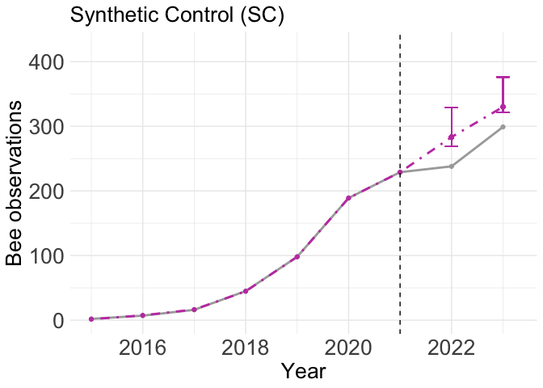
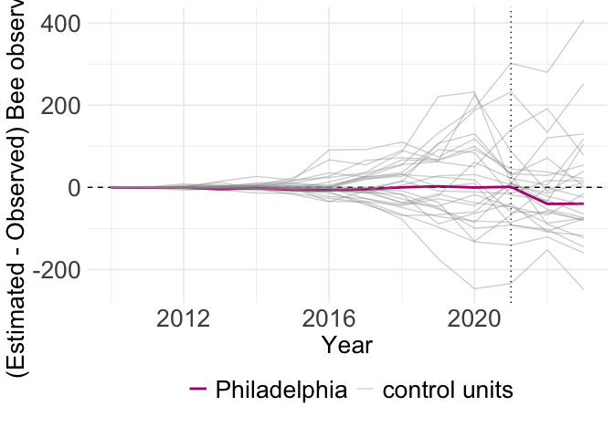
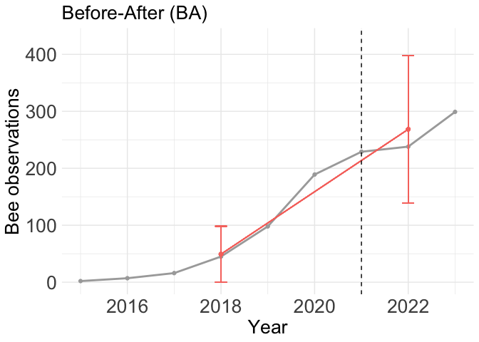
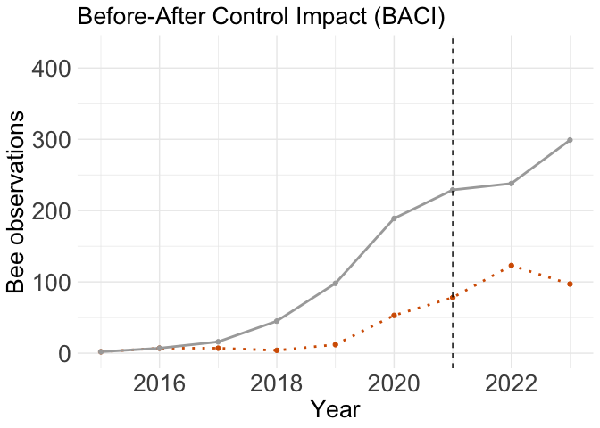
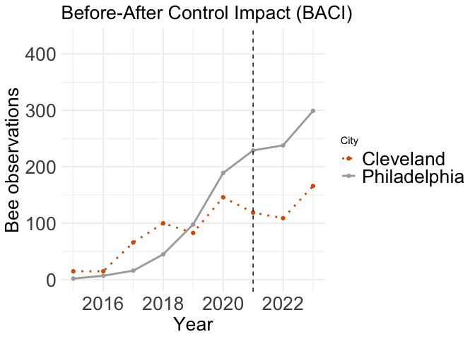
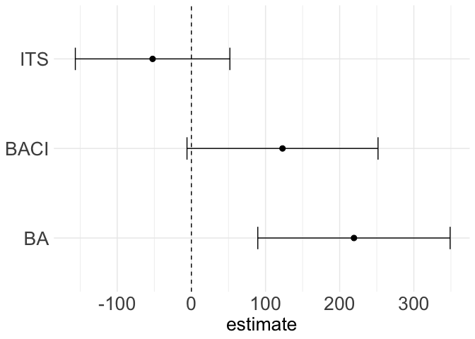
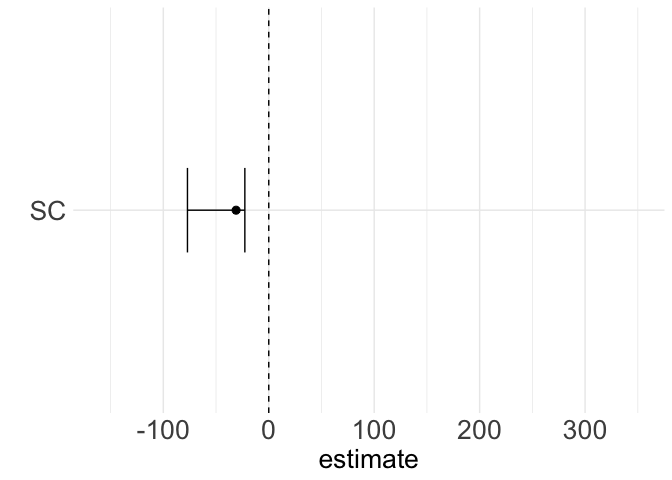

Synthetic Control Analysis
================
Asia Kaiser
2024-10-17

# Load Packages

``` r
library(tidyverse)
```

    ## ── Attaching core tidyverse packages ──────────────────────── tidyverse 2.0.0 ──
    ## ✔ dplyr     1.1.4     ✔ readr     2.1.5
    ## ✔ forcats   1.0.0     ✔ stringr   1.5.1
    ## ✔ ggplot2   3.5.1     ✔ tibble    3.2.1
    ## ✔ lubridate 1.9.3     ✔ tidyr     1.3.1
    ## ✔ purrr     1.0.2     
    ## ── Conflicts ────────────────────────────────────────── tidyverse_conflicts() ──
    ## ✖ dplyr::filter() masks stats::filter()
    ## ✖ dplyr::lag()    masks stats::lag()
    ## ℹ Use the conflicted package (<http://conflicted.r-lib.org/>) to force all conflicts to become errors

``` r
library(tidysynth)
library(nlme)
```

    ## 
    ## Attaching package: 'nlme'
    ## 
    ## The following object is masked from 'package:dplyr':
    ## 
    ##     collapse

``` r
library(AICcmodavg)
library(purrr)
library(ggpubr)
library(microsynth)
library(fixest)
library(lmerTest)
```

    ## Loading required package: lme4
    ## Loading required package: Matrix
    ## 
    ## Attaching package: 'Matrix'
    ## 
    ## The following objects are masked from 'package:tidyr':
    ## 
    ##     expand, pack, unpack
    ## 
    ## 
    ## Attaching package: 'lme4'
    ## 
    ## The following object is masked from 'package:AICcmodavg':
    ## 
    ##     checkConv
    ## 
    ## The following object is masked from 'package:nlme':
    ## 
    ##     lmList
    ## 
    ## 
    ## Attaching package: 'lmerTest'
    ## 
    ## The following object is masked from 'package:lme4':
    ## 
    ##     lmer
    ## 
    ## The following object is masked from 'package:stats':
    ## 
    ##     step

# Load in Data

``` r
rm(list = ls())
city.data <- read.csv("data/cities.scm.input.csv")
```

DELETE THIS CHUNK AFTER RERUNNING ‘GBIF DATA EXTRACTION SCRIPT’

# Synthetic Control Analysis in scpi Package

``` r
#write.csv(city.data, "city_dat.csv", row.names = FALSE)

# try in scpi
library(scpi)
```

    ## Warning: package 'scpi' was built under R version 4.4.1

``` r
library(data.table)
```

    ## 
    ## Attaching package: 'data.table'

    ## The following objects are masked from 'package:lubridate':
    ## 
    ##     hour, isoweek, mday, minute, month, quarter, second, wday, week,
    ##     yday, year

    ## The following objects are masked from 'package:dplyr':
    ## 
    ##     between, first, last

    ## The following object is masked from 'package:purrr':
    ## 
    ##     transpose

``` r
donor.cities <- unique(city.data$City)
donor.cities <- donor.cities[!(donor.cities == "Philadelphia")]
city.data$Temp <-scale(city.data$Temp)
city.data$Prec <- scale(city.data$Prec)
city.data$imperv45km <- scale(city.data$imperv45km)
city.data$Population <- scale(city.data$Population)
city.data$tcc45km <- scale(city.data$tcc45km)
city.data$area_km2 <- scale(city.data$area_km2)

feature.vars <- c("Temp","Prec","imperv45km","Population","nobs45km","tcc45km","area_km2")
city.data <- city.data %>%
  rename(unit.no = ID)


dat <- scdata(df = city.data,
              id.var = "City",
              time.var = "year",
              outcome.var = "nobs45km",
              period.pre = (2015:2021),
              period.post = (2022:2023),
              unit.tr = "Philadelphia",
              unit.co = donor.cities,
              features = feature.vars,
              cov.adj = list('Temp' = c(),
                             'Prec' = c(),
                             'imperv45km' = c(),
                             'Population' = c("constant","trend"),
                             'nobs45km' = c("constant","trend"),
                             'tcc45km' = c(),
                             'area_km2' = c()))
summary(dat)
```

    ## 
    ## Synthetic Control - Setup
    ## 
    ## Treated Unit:                              Philadelphia
    ## Size of the donor pool:                    26
    ## Features:                                  7
    ## Pre-treatment period:                      2015 || 2021
    ## Post-treatment period:                     2022 || 2023
    ## Pre-treatment periods used in estimation per feature:
    ##       Temp Population   area_km2       Prec   nobs45km    tcc45km imperv45km 
    ##          7          7          7          7          7          7          7 
    ## Covariates used for adjustment per feature:
    ##   nobs45km       Temp       Prec imperv45km Population    tcc45km   area_km2 
    ##          2          0          0          0          2          0          0

``` r
est.si  <- scest(data = dat)
summary(est.si)
```

    ## 
    ## Synthetic Control Prediction - Setup
    ## 
    ## Constraint Type:                           simplex
    ## Constraint Size (Q):                       1
    ## Treated Unit:                              Philadelphia
    ## Size of the donor pool:                    26
    ## Features:                                  7
    ## Pre-treatment period:                      2015-2021
    ## Pre-treatment periods used in prediction per feature:
    ##       Temp Population   area_km2       Prec   nobs45km    tcc45km imperv45km 
    ##          7          7          7          7          7          7          7 
    ## Covariates used for adjustment per feature:
    ##   nobs45km       Temp       Prec imperv45km Population    tcc45km   area_km2 
    ##          2          0          0          0          2          0          0 
    ## 
    ## Synthetic Control Prediction - Results
    ## 
    ## Active donors: 7 
    ## 
    ## Coefficients:
    ##               Weights
    ## Albuquerque     0.000
    ## Austin          0.000
    ## Charlotte       0.000
    ## Chicago         0.511
    ## Cincinnati      0.064
    ## Cleveland       0.000
    ## Columbus        0.000
    ## Dallas          0.000
    ## Denver          0.000
    ## Detroit         0.000
    ## Fort Worth      0.000
    ## Jacksonville    0.000
    ## Los Angeles     0.000
    ## Milwaukee       0.000
    ## Orlando         0.000
    ## Phoenix         0.000
    ## Raleigh         0.204
    ## Riverside       0.000
    ## Sacramento      0.000
    ## San Antonio     0.000
    ## San Diego       0.000
    ## San Francisco   0.066
    ## San Jose        0.026
    ## Santa Ana       0.045
    ## Seattle         0.000
    ## Tampa           0.084
    ##                                  Covariates
    ## Philadelphia.nobs45km.constant       -7.004
    ## Philadelphia.nobs45km.trend          -1.429
    ## Philadelphia.Population.constant     -0.082
    ## Philadelphia.Population.trend         0.005

``` r
#Estimating uncertainty
sims <- 1000
u.order <- 1
u.lags <- 0
u.sigma <- "HC1"
u.missp <- TRUE
e.order <- 1
e.lags <- 0
e.method <- "gaussian"
lgapp <- "linear"
cores <- 1
set.seed(0)
res.pi <- scpi(data = dat, sims = sims, e.method = e.method, e.order = e.order, e.lags = e.lags, u.order = u.order, u.lags = u.lags, u.sigma = u.sigma, u.missp = u.missp, cores = cores, w.constr = list(name = "simplex"))
```

    ## ---------------------------------------------------------------
    ## Estimating Weights...
    ## Quantifying Uncertainty
    ## Treated unit 1: 100/1000 iterations completed (10%) Treated unit 1: 200/1000 iterations completed (20%) Treated unit 1: 300/1000 iterations completed (30%) Treated unit 1: 400/1000 iterations completed (40%) Treated unit 1: 500/1000 iterations completed (50%) Treated unit 1: 600/1000 iterations completed (60%) Treated unit 1: 700/1000 iterations completed (70%) Treated unit 1: 800/1000 iterations completed (80%) Treated unit 1: 900/1000 iterations completed (90%) Treated unit 1: 1000/1000 iterations completed (100%) 

    ## Warning: One of e.order > 0 and e.lags > 0 was specified, however the current
    ## number of observations (7) used to estimate conditional moments of the
    ## out-of-sample error is not larger than the number of parameters used in
    ## estimation (5) plus 10. To avoid over-fitting issues e.order and e.lags were
    ## set to 0.

``` r
?scpi
summary(res.pi)
```

    ## 
    ## Synthetic Control Prediction - Setup
    ## 
    ## Constraint Type:                           simplex
    ## Constraint Size (Q):                       1
    ## Treated Unit:                              Philadelphia
    ## Size of the donor pool:                    26
    ## Features:                                  7
    ## Pre-treatment period:                      2015-2021
    ## Pre-treatment periods used in prediction per feature:
    ##       Temp Population   area_km2       Prec   nobs45km    tcc45km imperv45km 
    ##          7          7          7          7          7          7          7 
    ## Covariates used for adjustment per feature:
    ##   nobs45km       Temp       Prec imperv45km Population    tcc45km   area_km2 
    ##          2          0          0          0          2          0          0 
    ## 
    ## Synthetic Control Prediction - Results
    ## 
    ## Active donors: 7 
    ## 
    ## Coefficients:
    ##               Weights
    ## Albuquerque     0.000
    ## Austin          0.000
    ## Charlotte       0.000
    ## Chicago         0.511
    ## Cincinnati      0.064
    ## Cleveland       0.000
    ## Columbus        0.000
    ## Dallas          0.000
    ## Denver          0.000
    ## Detroit         0.000
    ## Fort Worth      0.000
    ## Jacksonville    0.000
    ## Los Angeles     0.000
    ## Milwaukee       0.000
    ## Orlando         0.000
    ## Phoenix         0.000
    ## Raleigh         0.204
    ## Riverside       0.000
    ## Sacramento      0.000
    ## San Antonio     0.000
    ## San Diego       0.000
    ## San Francisco   0.066
    ## San Jose        0.026
    ## Santa Ana       0.045
    ## Seattle         0.000
    ## Tampa           0.084
    ##                                  Covariates
    ## Philadelphia.nobs45km.constant       -7.004
    ## Philadelphia.nobs45km.trend          -1.429
    ## Philadelphia.Population.constant     -0.082
    ## Philadelphia.Population.trend         0.005
    ## 
    ## Synthetic Control Inference - Setup
    ## 
    ## In-sample Inference:                       
    ##      Misspecified model                    TRUE
    ##      Order of polynomial (B)               1
    ##      Lags (B)                              0
    ##      Variance-Covariance Estimator         HC1
    ##      Parameters used to estimate moments   25
    ## 
    ## Out-of-sample Inference:                   
    ##      Method                                gaussian
    ##      Order of polynomial (B)               0
    ##      Lags (B)                              0
    ##      Parameters used to estimate moments   1
    ## 
    ## 
    ## Synthetic Control Inference - Results
    ## 
    ##   Inference with subgaussian bounds   
    ##                   Treated Synthetic Left Bound Right Bound
    ## Philadelphia.2022     238   283.317    268.804     328.980
    ## Philadelphia.2023     299   329.979    321.669     376.095

``` r
scplot(res.pi, e.out = TRUE)
```

    ## $plot_out

<!-- -->

``` r
nobs45km <- as.numeric(c(res.pi$data$Y.pre[,1],
                                   res.pi$data$Y.post[,1],
                                   res.pi$est.results$Y.pre.fit[,1],
                                   res.pi$est.results$Y.post.fit[,1]))
year <- rep(2015:2023,2)
Treatment <- c(rep("Philadelphia",9), rep("Synthetic Control",9))

scpi.data <- tibble(nobs45km,year,Treatment)

(decline.2023 <- ((329.979- 299)/329.979)*100)
```

    ## [1] 9.388173

``` r
(decline.2022 <- ((283.317-238)/283.317)*100) 
```

    ## [1] 15.99516

GGplot of Scpi estimates

Creating Personal Theme

``` r
Asia_Theme <- theme(
  plot.title = element_text(size = 20),
  plot.caption = element_text(size = 16),
  axis.title = element_text(size = 20),
  axis.text = element_text(size = 20),
  axis.text.x = element_text(size = 20),
  legend.text = element_text(size= 20))
```

``` r
scpi.plot <- ggplot(scpi.data, aes(x = year, y = nobs45km, color = Treatment)) +
    geom_line(linewidth = 1, aes(linetype = Treatment))+
  geom_point()+
    geom_point(aes(x = 2022, y = 283.317, color = "#c443b2", group = 1))+
        geom_errorbar(aes(x = 2022, ymin = 268.804, ymax = 328.980, color = "#c443b2"), width = 0.25)+
    geom_point(aes(x = 2023, y = 329.979, color = "#c443b2", group = 1))+
    geom_errorbar(aes(x = 2023, ymin = 321.669, ymax = 376.095, color = "#c443b2"), width = 0.25)+
  scale_linetype_manual(values=c(1,4,1))+
  scale_color_manual(values=c("#c443b2","darkgrey","#c443b2"))+
  geom_vline(xintercept = 2021, linetype="dashed")+
  labs(title = "Synthetic Control (SC)",
       x = "Year",
       y = "Bee observations") +
  theme_minimal()+
  theme(legend.position = "none")+
  Asia_Theme+
    ylim(0,425)+
    xlim(2015,2023.25)
scpi.plot
```

    ## Warning in geom_point(aes(x = 2022, y = 283.317, color = "#c443b2", group = 1)): All aesthetics have length 1, but the data has 18 rows.
    ## ℹ Please consider using `annotate()` or provide this layer with data containing
    ##   a single row.

    ## Warning in geom_point(aes(x = 2023, y = 329.979, color = "#c443b2", group = 1)): All aesthetics have length 1, but the data has 18 rows.
    ## ℹ Please consider using `annotate()` or provide this layer with data containing
    ##   a single row.

<!-- -->

# Synthetic Control Analysis in tidysynth Package

## Creating the Synthetic Control

- Creating the control objects
- Selecting the predictors
- Generating weights

# Reload in the Data

``` r
city.data <- read.csv("data/cities.scm.input.csv")
```

DELETE THIS CHUNK AFTER RERUNNING ‘GBIF DATA EXTRACTION SCRIPT’

Tidysynth

``` r
# Create synthetic control object
gbifcity_out <- city.data %>%
  # Initial synthetic control object
  synthetic_control(outcome = nobs45km, # outcome
                    unit = City, # unit index in the panel data
                    time = year, # time index in the panel data
                    i_unit = "Philadelphia", # unit where the intervention occurred
                    i_time = 2021, # time period when the intervention occurred
                    generate_placebos = TRUE # generate placebo synthetic controls (for inference)
  ) %>%
  
  #Generate aggregate predictors to fit weights to each unit
  generate_predictor(time_window = 2015:2023,
                     Population = mean(Population, rm.na= TRUE),
                     ) %>%

  generate_predictor(time_window = 2021,
                     "Temperature" = Temp,
                     "Precipitation" = Prec,
                     "Tree canopy cover" = tcc45km,                     ,
                     "Impervious surface" = imperv45km,
                     "Area (km2)" = area_km2
                     ) %>%

  # Generate the fitted weights for the synthetic control
  generate_weights(optimization_window = 2015:2021, # time to use in the optimization task
                   margin_ipop = .02,sigf_ipop = 7,bound_ipop = 6 # optimizer options
  ) %>%
  
  # Generate the synthetic control
  generate_control()
```

## Visualizing the data

**Trends**: plot of trends of observed (treated) unit compared to
synthetic control over time, with dashed vertical line representing the
treatment event.

``` r
trendplot <- gbifcity_out %>% plot_trends()+
  Asia_Theme +
  labs(title = "Synthetic Control (SC)", caption = NULL,
        x = "Year",
        y = "Bee observations")+
    ylim(0,425)+
    xlim(2015,2023)+
    theme(legend.position = "none")
trendplot
```

    ## Warning: Removed 10 rows containing missing values or values outside the scale range
    ## (`geom_line()`).

    ## Warning: Removed 10 rows containing missing values or values outside the scale range
    ## (`geom_point()`).

<!-- -->

**Differences**: plot of difference in outcome variable between the
observed (treated) unit and the estimated outcome of the synthetic
control.

``` r
diffplot <- gbifcity_out %>% plot_differences()+
  Asia_Theme +
  labs(title = NULL, subtitle = NULL,
        x = "Year",
        y = "(Estimated - Observed) Bee observations")
```

**Weights**: Barplots showing the relative contributions (weights) of
each control unit and each predictor/variable unit to the synthetic
control.

``` r
weightplot <- gbifcity_out %>% plot_weights()+
  Asia_Theme +
  labs(title = NULL, subtitle = NULL,
       y = "Weight")
weightplot
```

<!-- -->

**Balance Table**: A table with values of the predictors/variables so
that you can see how similar the synthetic control is to observed
variables of the treated unit.

``` r
balancetab <- gbifcity_out %>% grab_balance_table() %>%
    mutate(synthetic_percent_diff = ((Philadelphia - synthetic_Philadelphia)/Philadelphia)*100,
           donor_percent_diff = ((Philadelphia - donor_sample)/Philadelphia)*100)
```

## Inference

**In-space placebos**: The same as difference plot above, this time
comparing each control unit to the synthetic control. This is to see if
the difference between the treated unit and the synthetic control
actually stands out as significantly greater.

``` r
placebos <- gbifcity_out %>% plot_placebos(prune = FALSE)+
  Asia_Theme +
  labs(title = NULL, subtitle = NULL,
        x = "Year",
        y = "(Estimated - Observed) Bee observations")
placebos
```

<!-- -->

**Ratio of pre and post intervention period mean squared predictive
error (mspe)**

``` r
mpseratio <- gbifcity_out %>% plot_mspe_ratio()+
  Asia_Theme +
  labs(title = NULL, subtitle = NULL)
mpseratio
```

<!-- -->

### Significance table

**Constructing Fisher’s Exact P-value**: This table takes the mspe ratio
and lists units in descending order. P-values are constructed by
dividing a units rank by the total. *You need at least 20 cases in the
unit pool to achieve a p-value below .05*

``` r
significance.tab <- gbifcity_out %>% grab_significance()
significance.tab <- as.data.frame(significance.tab)

#This code provides the causal estimate value (difference in outcome between the synthetic control and the observed treated unit)
gbifcity_out %>% grab_synthetic_control()%>%
  filter(time_unit == 2022)%>%
  mutate(causal_estimate= synth_y - real_y)%>%
  mutate(percent_estimate= (causal_estimate/synth_y)*100)%>%
  head
```

    ## # A tibble: 1 × 5
    ##   time_unit real_y synth_y causal_estimate percent_estimate
    ##       <int>  <int>   <dbl>           <dbl>            <dbl>
    ## 1      2022    238    278.            40.3             14.5

# Other Approaches

## Before-After (BA) Analysis w/ closest city with similar population size (naive selection)

``` r
#Create relevant dummy variables
city.data.ba <- city.data %>%
    filter(City == "Philadelphia")%>%
    mutate(Treatment = ifelse(year > 2021,1,0))

#ba.model <- feols(nobs45km ~ Treatment, data = city.data.ba, cluster = ~City)

ba.model <- lm(nobs45km ~ Treatment, data = city.data.ba)
summary(ba.model)
```

    ## 
    ## Call:
    ## lm(formula = nobs45km ~ Treatment, data = city.data.ba)
    ## 
    ## Residuals:
    ##    Min     1Q Median     3Q    Max 
    ## -49.25 -48.00 -37.75  21.81 179.75 
    ## 
    ## Coefficients:
    ##             Estimate Std. Error t value Pr(>|t|)   
    ## (Intercept)    49.25      22.50   2.189  0.04907 * 
    ## Treatment     219.25      59.52   3.684  0.00313 **
    ## ---
    ## Signif. codes:  0 '***' 0.001 '**' 0.01 '*' 0.05 '.' 0.1 ' ' 1
    ## 
    ## Residual standard error: 77.93 on 12 degrees of freedom
    ## Multiple R-squared:  0.5307, Adjusted R-squared:  0.4916 
    ## F-statistic: 13.57 on 1 and 12 DF,  p-value: 0.003127

``` r
confint.ba <- confint(ba.model)
confint.ba
```

    ##                  2.5 %    97.5 %
    ## (Intercept)  0.2365472  98.26345
    ## Treatment   89.5725931 348.92741

*BA plot with most similar city*

``` r
ba.plot <- ggplot(city.data.ba, aes(x = year, y = nobs45km)) +
    geom_line(linewidth = 1, color = "darkgrey")+
  geom_point(color = "darkgrey")+
    geom_point(aes(x = 2018, y = ba.model$coefficients[1], color = "#8B0000", group = 1))+
        geom_errorbar(aes(x = 2018, ymin = 0, ymax = confint.ba[3], color = "#8B0000"), width = 0.25)+
    geom_point(aes(x = 2022, y = ( ba.model$coefficients[1] + ba.model$coefficients[2]), color = "#8B0000", group = 1))+
    geom_errorbar(aes(x = 2022, ymin = ( ba.model$coefficients[1] + confint.ba[2]), ymax = ( ba.model$coefficients[1] + confint.ba[4]), color = "#8B0000"), width = 0.25)+
    geom_segment(aes(x = 2018, y = ba.model$coefficients[1], xend = 2022, yend =  ( ba.model$coefficients[1] + ba.model$coefficients[2]), colour = "#8B0000"))+
  geom_vline(xintercept = 2021, linetype="dashed")+
  labs(title = "Before-After (BA)",
       x = "Year",
       y = "Bee observations") +
  theme_minimal()+
  theme(legend.position = "none")+
  Asia_Theme+
    ylim(0,425)+
    xlim(2015,2023)
ba.plot
```

<!-- -->

\##Before- After Control Impact (BACI) Analysis w/ closest city with
similar population size (naive selection)

``` r
#Creating the relevant dummy variables
city.data.baci <- city.data %>%
  mutate(Time = ifelse(year > 2021, 1, 0)) %>%
  mutate(Treated = if_else(City == "Philadelphia",1,0))%>%
    filter(City == "Philadelphia" | City == "Detroit")

#Running the Before- After Control Impact model
#baci.model <- feols(nobs45km ~ Treated * Time, data = city.data.baci, cluster = ~City)
baci.model <- lm(nobs45km ~ Treated * Time, data = city.data.baci)

summary(baci.model)
```

    ## 
    ## Call:
    ## lm(formula = nobs45km ~ Treated * Time, data = city.data.baci)
    ## 
    ## Residuals:
    ##    Min     1Q Median     3Q    Max 
    ## -49.25 -35.50 -12.83   2.00 179.75 
    ## 
    ## Coefficients:
    ##              Estimate Std. Error t value Pr(>|t|)  
    ## (Intercept)     13.67      16.68   0.819   0.4206  
    ## Treated         35.58      23.59   1.509   0.1445  
    ## Time            96.33      44.13   2.183   0.0391 *
    ## Treated:Time   122.92      62.41   1.970   0.0605 .
    ## ---
    ## Signif. codes:  0 '***' 0.001 '**' 0.01 '*' 0.05 '.' 0.1 ' ' 1
    ## 
    ## Residual standard error: 57.78 on 24 degrees of freedom
    ## Multiple R-squared:  0.5958, Adjusted R-squared:  0.5452 
    ## F-statistic: 11.79 on 3 and 24 DF,  p-value: 6.073e-05

``` r
confint.baci <- confint(baci.model)
confint.baci
```

    ##                   2.5 %   97.5 %
    ## (Intercept)  -20.758166  48.0915
    ## Treated      -13.100732  84.2674
    ## Time           5.253788 187.4129
    ## Treated:Time  -5.889262 251.7226

``` r
#shows significant increases in Philadelphia bee abundance when compared to Detroit
```

*BACI plot with most similar city*

``` r
palette.colors(palette = "Okabe-Ito")
```

    ## [1] "#000000" "#E69F00" "#56B4E9" "#009E73" "#F0E442" "#0072B2" "#D55E00"
    ## [8] "#CC79A7" "#999999"

``` r
baci.plot <- ggplot(city.data.baci, aes(x = year, y = nobs45km, color = City)) +
    geom_line(linewidth = 1, aes(linetype = City))+
  geom_point()+
  scale_linetype_manual(values=c(3,1))+
  scale_color_manual(values=c('#D55E00','darkgrey'))+
  geom_vline(xintercept = 2021, linetype="dashed")+
  labs(title = "Before-After Control Impact (BACI)",
       x = "Year",
       y = "Bee observations") +
  theme_minimal()+
  theme(legend.position = "none")+
  Asia_Theme+
    ylim(0,425)+
    xlim(2015,2023)

baci.plot
```

<!-- -->

Before- After Control Impact (BACI) Analysis w/ Cleveland

``` r
#Creating the relevant dummy variables
city.data.baci.2 <- city.data %>%
  mutate(Time = ifelse(year > 2021, 1, 0)) %>%
  mutate(Treated = if_else(City == "Philadelphia",1,0))%>%
    filter(City == "Philadelphia" | City == "Cleveland")

#Running the Before- After Control Impact model
#baci.model <- feols(nobs45km ~ Treated * Time, data = city.data.baci, cluster = ~City)
baci.model.2 <- lm(nobs45km ~ Treated * Time, data = city.data.baci.2)

summary(baci.model.2)
```

    ## 
    ## Call:
    ## lm(formula = nobs45km ~ Treated * Time, data = city.data.baci.2)
    ## 
    ## Residuals:
    ##    Min     1Q Median     3Q    Max 
    ## -49.25 -45.50 -32.25  31.81 179.75 
    ## 
    ## Coefficients:
    ##              Estimate Std. Error t value Pr(>|t|)  
    ## (Intercept)     47.25      19.10   2.474   0.0208 *
    ## Treated          2.00      27.01   0.074   0.9416  
    ## Time            90.25      50.53   1.786   0.0868 .
    ## Treated:Time   129.00      71.47   1.805   0.0836 .
    ## ---
    ## Signif. codes:  0 '***' 0.001 '**' 0.01 '*' 0.05 '.' 0.1 ' ' 1
    ## 
    ## Residual standard error: 66.17 on 24 degrees of freedom
    ## Multiple R-squared:  0.4859, Adjusted R-squared:  0.4216 
    ## F-statistic:  7.56 on 3 and 24 DF,  p-value: 0.0009958

``` r
confint.baci.2 <- confint(baci.model.2)
confint.baci.2
```

    ##                   2.5 %    97.5 %
    ## (Intercept)    7.829121  86.67088
    ## Treated      -53.749542  57.74954
    ## Time         -14.047842 194.54784
    ## Treated:Time -18.499423 276.49942

``` r
#shows significant increases in Philadelphia bee abundance when compared to Detroit
```

*BACI plot with Cleveland*

``` r
palette.colors(palette = "Okabe-Ito")
```

    ## [1] "#000000" "#E69F00" "#56B4E9" "#009E73" "#F0E442" "#0072B2" "#D55E00"
    ## [8] "#CC79A7" "#999999"

``` r
baci.plot.2 <- ggplot(city.data.baci.2, aes(x = year, y = nobs45km, color = City)) +
    geom_line(linewidth = 1, aes(linetype = City))+
  geom_point()+
  scale_linetype_manual(values=c(3,1))+
  scale_color_manual(values=c('#D55E00','darkgrey'))+
  geom_vline(xintercept = 2021, linetype="dashed")+
  labs(title = "Before-After Control Impact (BACI)",
       x = "Year",
       y = "Bee observations") +
  theme_minimal()+
  Asia_Theme+
    ylim(0,425)+
    xlim(2015,2023)

baci.plot.2
```

<!-- -->

## Interrupted Time Series (ITS) Regression

Explanation of ITS modelling:
<https://rpubs.com/chrissyhroberts/1006858>

``` r
#Creating the relevant dummy variables in dataframe
city.data.its <- city.data %>%
  filter(City == "Philadelphia" & year >= 2015)%>%
  mutate(Treated = if_else(year > 2021, 1, 0))%>%
  mutate(Time_since= if_else(year <= 2021, 0, (year-2020)))
city.data.its
```

    ##           City State_Abbrev        State area_km2      Lat      Long  ID
    ## 1 Philadelphia           PA Pennsylvania      348 39.95258 -75.16522 249
    ## 2 Philadelphia           PA Pennsylvania      348 39.95258 -75.16522 249
    ## 3 Philadelphia           PA Pennsylvania      348 39.95258 -75.16522 249
    ## 4 Philadelphia           PA Pennsylvania      348 39.95258 -75.16522 249
    ## 5 Philadelphia           PA Pennsylvania      348 39.95258 -75.16522 249
    ## 6 Philadelphia           PA Pennsylvania      348 39.95258 -75.16522 249
    ## 7 Philadelphia           PA Pennsylvania      348 39.95258 -75.16522 249
    ## 8 Philadelphia           PA Pennsylvania      348 39.95258 -75.16522 249
    ## 9 Philadelphia           PA Pennsylvania      348 39.95258 -75.16522 249
    ##       Temp Prec   tcc45km imperv45km year Population nobs45km  rich45km
    ## 1 12.74951 1141 252934612  127985949 2015    1571065        2  2.500000
    ## 2 12.74951 1141 252934612  127985949 2016    1576051        7  6.928571
    ## 3 12.74951 1141 252934612  127985949 2017    1580601       16  5.234375
    ## 4 12.74951 1141 252934612  127985949 2018    1583592       45 35.800000
    ## 5 12.74951 1141 252934612  127985949 2019    1584064       98 22.938776
    ## 6 12.74951 1141 252934612  127985949 2020    1600684      189 35.947090
    ## 7 12.74951 1141 252934612  127985949 2021    1589623      229 55.393013
    ## 8 12.74951 1141 252934612  127985949 2022    1566836      238 69.973214
    ## 9 12.74951 1141 252934612  127985949 2023    1550542      299 37.536975
    ##   shann45km Treated Time_since
    ## 1  3.375000       0          0
    ## 2  7.924083       0          0
    ## 3  4.494448       0          0
    ## 4 15.464085       0          0
    ## 5 10.665252       0          0
    ## 6 11.225539       0          0
    ## 7 12.968323       0          0
    ## 8 14.903670       1          2
    ## 9 12.043038       1          3

``` r
#Running the its regression
its.model <- gls(nobs45km ~ year + Treated + Time_since, data = city.data.its, correlation= corARMA(p=1, q=1, form = ~ year), method = "ML")
summary(its.model)
```

    ## Generalized least squares fit by maximum likelihood
    ##   Model: nobs45km ~ year + Treated + Time_since 
    ##   Data: city.data.its 
    ##        AIC      BIC    logLik
    ##   91.60649 92.98706 -38.80325
    ## 
    ## Correlation Structure: ARMA(1,1)
    ##  Formula: ~year 
    ##  Parameter estimate(s):
    ##      Phi1    Theta1 
    ## 0.2316104 0.9999800 
    ## 
    ## Coefficients:
    ##                 Value Std.Error   t-value p-value
    ## (Intercept) -74968.68 15488.471 -4.840290  0.0047
    ## year            37.19     7.675  4.845942  0.0047
    ## Treated        -52.27    53.170 -0.983134  0.3707
    ## Time_since      25.74    30.498  0.844084  0.4371
    ## 
    ##  Correlation: 
    ##            (Intr) year   Treatd
    ## year       -1.000              
    ## Treated    -0.421  0.421       
    ## Time_since  0.626 -0.627 -0.888
    ## 
    ## Standardized residuals:
    ##         Min          Q1         Med          Q3         Max 
    ## -1.69982394 -1.06753166  0.02334903  1.04349175  1.19709439 
    ## 
    ## Residual standard error: 24.99896 
    ## Degrees of freedom: 9 total; 5 residual

``` r
#confidence intervals for the its regression
confint.its <- confint(its.model)
```

ITS Plot - making predictions

``` r
#Creating model for counterfactual
city.data.its.2 <-filter(city.data.its, year <= 2021)
its.counter = gls(nobs45km ~ year, data = city.data.its.2, correlation= corARMA(p=1, q=1, form = ~ year),method="ML")

#Adding prediction intervals for counterfactual back to dataframe
city.data.its <-city.data.its %>% mutate(
  counter.predictions = predictSE.gls (its.counter, newdata = city.data.its, se.fit=T)$fit,
  counter.se = predictSE.gls (its.counter, city.data.its, se.fit=T)$se
)
```

Plot

``` r
its.plot <- ggplot(city.data.its,
         aes(x = year, y = nobs45km))+
  geom_ribbon(aes(ymin = counter.predictions - (1.96*counter.se), ymax = counter.predictions + (1.96*counter.se)), fill = 'turquoise', alpha = .2, linetype = 2)+
  geom_line(aes(year,counter.predictions),color='turquoise', lty = 4)+
  geom_point(color = 'darkgrey')+
    geom_line(color = 'darkgrey', linewidth = 1)+
      scale_linetype_manual(values=1)+
    geom_vline(xintercept = 2021, linetype="dashed")+
    xlim(2015,2023)+
    ylim(0,425)+
      labs(title = "Interrupted Time Series (ITS)",
       x = "Year",
       y = "Bee observations")+
    theme_minimal()+
    Asia_Theme
its.plot
```

    ## Warning: Removed 1 row containing missing values or values outside the scale range
    ## (`geom_line()`).

<!-- -->
\#Confidence Intervals

Confidence interval plot for effect sizes in 2022 for all approaches

``` r
#Put coefficient and confidence interval estimates in single dataframe
method <- c("BA","BACI","ITS")
estimate <- c(ba.model$coefficients[2],baci.model$coefficients[4],its.model$coefficients[3])
lwrCI <- c(confint.ba[2],confint.baci[4],confint.its[3]) #replace SCM CI
uprCI <- c(confint.ba[4],confint.baci[8],confint.its[7])
ci.data <- tibble(method,estimate,lwrCI,uprCI)
```

CI Forest plot - Alternative methods

``` r
ci.plot <- ggplot(ci.data,
       aes(x = estimate, y = method))+
    geom_errorbar(
        aes(xmin = lwrCI, xmax = uprCI), width = 0.25)+
    geom_point(size = 2.5)+
    geom_vline(xintercept = 0, linetype = 2)+
    xlim(-160,350)+
    theme_minimal()+
    Asia_Theme+
    theme(axis.title.y = element_blank())
ci.plot
```

<!-- -->
CI plot - synthetic control method

``` r
method <- "   SC"
estimate <- (299 - 329.979) 
lwrCI <- (299 - 376.095)
uprCI <- (299 - 321.669)
scm.ci.data <- tibble(method,estimate,lwrCI,uprCI)

scm.ci.plot <- ggplot(scm.ci.data,
       aes(x = estimate, y = method))+
    geom_errorbar(
        aes(xmin = lwrCI, xmax = uprCI), width = 0.25)+
    geom_point(size = 2.5)+
    geom_vline(xintercept = 0, linetype = 2)+
    xlim(-160,350)+
    theme_minimal()+
    Asia_Theme+
    theme(axis.title.y = element_blank())
scm.ci.plot
```

<!-- -->

# Save Figures

``` r
trends.figure <- ggarrange(its.plot,baci.plot,ba.plot,ci.plot,scpi.plot,scm.ci.plot,
                    labels = c("A","B","C","D","E","F"), nrow = 3, ncol = 2)
ggsave("figures/BACIplot_Cleveland.png", plot = baci.plot.2)
```

    ## Saving 7 x 5 in image

``` r
ggsave("figures/Difference plot.png", plot = diffplot)
```

    ## Saving 7 x 5 in image

``` r
ggsave("figures/Weight plot.png", plot = weightplot, height = 6, width = 12)
ggsave("figures/Placebos plot.png", plot = placebos)
```

    ## Saving 7 x 5 in image

``` r
ggsave("figures/MPSE ratio plot.png", plot = mpseratio)
```

    ## Saving 7 x 5 in image

``` r
ggsave("figures/Method comparison plot.png", plot = trends.figure, height = 12, width = 11)
```

# Citations

``` r
citation()
```

    ## To cite R in publications use:
    ## 
    ##   R Core Team (2024). _R: A Language and Environment for Statistical
    ##   Computing_. R Foundation for Statistical Computing, Vienna, Austria.
    ##   <https://www.R-project.org/>.
    ## 
    ## A BibTeX entry for LaTeX users is
    ## 
    ##   @Manual{,
    ##     title = {R: A Language and Environment for Statistical Computing},
    ##     author = {{R Core Team}},
    ##     organization = {R Foundation for Statistical Computing},
    ##     address = {Vienna, Austria},
    ##     year = {2024},
    ##     url = {https://www.R-project.org/},
    ##   }
    ## 
    ## We have invested a lot of time and effort in creating R, please cite it
    ## when using it for data analysis. See also 'citation("pkgname")' for
    ## citing R packages.

``` r
devtools::session_info()
```

    ## ─ Session info ───────────────────────────────────────────────────────────────
    ##  setting  value
    ##  version  R version 4.4.0 (2024-04-24)
    ##  os       macOS 15.1.1
    ##  system   x86_64, darwin20
    ##  ui       X11
    ##  language (EN)
    ##  collate  en_US.UTF-8
    ##  ctype    en_US.UTF-8
    ##  tz       America/Denver
    ##  date     2025-02-28
    ##  pandoc   3.1.11 @ /Applications/RStudio.app/Contents/Resources/app/quarto/bin/tools/x86_64/ (via rmarkdown)
    ## 
    ## ─ Packages ───────────────────────────────────────────────────────────────────
    ##  package      * version    date (UTC) lib source
    ##  abind          1.4-8      2024-09-12 [1] CRAN (R 4.4.1)
    ##  AICcmodavg   * 2.3-3      2023-11-16 [1] CRAN (R 4.4.0)
    ##  backports      1.5.0      2024-05-23 [1] CRAN (R 4.4.0)
    ##  bit            4.0.5      2022-11-15 [1] CRAN (R 4.4.0)
    ##  bit64          4.0.5      2020-08-30 [1] CRAN (R 4.4.0)
    ##  boot           1.3-30     2024-02-26 [1] CRAN (R 4.4.0)
    ##  broom          1.0.6      2024-05-17 [1] CRAN (R 4.4.0)
    ##  cachem         1.1.0      2024-05-16 [1] CRAN (R 4.4.0)
    ##  car            3.1-2      2023-03-30 [1] CRAN (R 4.4.0)
    ##  carData        3.0-5      2022-01-06 [1] CRAN (R 4.4.0)
    ##  cli            3.6.3      2024-06-21 [1] CRAN (R 4.4.0)
    ##  coda           0.19-4.1   2024-01-31 [1] CRAN (R 4.4.0)
    ##  codetools      0.2-20     2024-03-31 [1] CRAN (R 4.4.0)
    ##  colorspace     2.1-0      2023-01-23 [1] CRAN (R 4.4.0)
    ##  conquer        1.3.3      2023-03-06 [1] CRAN (R 4.4.0)
    ##  cowplot        1.1.3      2024-01-22 [1] CRAN (R 4.4.0)
    ##  cubature       2.1.1      2024-07-14 [1] CRAN (R 4.4.0)
    ##  CVXR           1.0-15     2024-11-07 [1] CRAN (R 4.4.1)
    ##  data.table   * 1.15.4     2024-03-30 [1] CRAN (R 4.4.0)
    ##  devtools       2.4.5      2022-10-11 [1] CRAN (R 4.4.0)
    ##  digest         0.6.36     2024-06-23 [1] CRAN (R 4.4.0)
    ##  doSNOW         1.0.20     2022-02-04 [1] CRAN (R 4.4.0)
    ##  dplyr        * 1.1.4      2023-11-17 [1] CRAN (R 4.4.0)
    ##  dreamerr       1.4.0      2023-12-21 [1] CRAN (R 4.4.0)
    ##  ECOSolveR      0.5.5      2023-05-15 [1] CRAN (R 4.4.0)
    ##  ellipsis       0.3.2      2021-04-29 [1] CRAN (R 4.4.0)
    ##  emmeans        1.10.2     2024-05-20 [1] CRAN (R 4.4.0)
    ##  estimability   1.5.1      2024-05-12 [1] CRAN (R 4.4.0)
    ##  evaluate       0.24.0     2024-06-10 [1] CRAN (R 4.4.0)
    ##  fansi          1.0.6      2023-12-08 [1] CRAN (R 4.4.0)
    ##  farver         2.1.2      2024-05-13 [1] CRAN (R 4.4.0)
    ##  fastDummies    1.7.4      2024-08-16 [1] CRAN (R 4.4.1)
    ##  fastmap        1.2.0      2024-05-15 [1] CRAN (R 4.4.0)
    ##  fixest       * 0.12.1     2024-06-13 [1] CRAN (R 4.4.0)
    ##  forcats      * 1.0.0      2023-01-29 [1] CRAN (R 4.4.0)
    ##  foreach        1.5.2      2022-02-02 [1] CRAN (R 4.4.0)
    ##  Formula        1.2-5      2023-02-24 [1] CRAN (R 4.4.0)
    ##  fs             1.6.4      2024-04-25 [1] CRAN (R 4.4.0)
    ##  generics       0.1.3      2022-07-05 [1] CRAN (R 4.4.0)
    ##  ggplot2      * 3.5.1      2024-04-23 [1] CRAN (R 4.4.0)
    ##  ggpubr       * 0.6.0      2023-02-10 [1] CRAN (R 4.4.0)
    ##  ggsignif       0.6.4      2022-10-13 [1] CRAN (R 4.4.0)
    ##  glmx           0.2-1      2024-09-04 [1] CRAN (R 4.4.1)
    ##  glue           1.8.0      2024-09-30 [1] CRAN (R 4.4.1)
    ##  gmp            0.7-5      2024-08-23 [1] CRAN (R 4.4.1)
    ##  gtable         0.3.5      2024-04-22 [1] CRAN (R 4.4.0)
    ##  gtools         3.9.5      2023-11-20 [1] CRAN (R 4.4.0)
    ##  highr          0.11       2024-05-26 [1] CRAN (R 4.4.0)
    ##  hms            1.1.3      2023-03-21 [1] CRAN (R 4.4.0)
    ##  htmltools      0.5.8.1    2024-04-04 [1] CRAN (R 4.4.0)
    ##  htmlwidgets    1.6.4      2023-12-06 [1] CRAN (R 4.4.0)
    ##  httpuv         1.6.15     2024-03-26 [1] CRAN (R 4.4.0)
    ##  iterators      1.0.14     2022-02-05 [1] CRAN (R 4.4.0)
    ##  kernlab        0.9-32     2023-01-31 [1] CRAN (R 4.4.0)
    ##  knitr          1.48       2024-07-07 [1] CRAN (R 4.4.0)
    ##  labeling       0.4.3      2023-08-29 [1] CRAN (R 4.4.0)
    ##  later          1.3.2      2023-12-06 [1] CRAN (R 4.4.0)
    ##  lattice        0.22-6     2024-03-20 [1] CRAN (R 4.4.0)
    ##  lifecycle      1.0.4      2023-11-07 [1] CRAN (R 4.4.0)
    ##  lme4         * 1.1-35.3   2024-04-16 [1] CRAN (R 4.4.0)
    ##  lmerTest     * 3.1-3      2020-10-23 [1] CRAN (R 4.4.0)
    ##  lmtest         0.9-40     2022-03-21 [1] CRAN (R 4.4.0)
    ##  lubridate    * 1.9.3      2023-09-27 [1] CRAN (R 4.4.0)
    ##  magrittr       2.0.3      2022-03-30 [1] CRAN (R 4.4.0)
    ##  MASS           7.3-60.2   2024-04-24 [1] local
    ##  Matrix       * 1.7-0      2024-03-22 [1] CRAN (R 4.4.0)
    ##  MatrixModels   0.5-3      2023-11-06 [1] CRAN (R 4.4.0)
    ##  matrixStats    1.4.1      2024-09-08 [1] CRAN (R 4.4.1)
    ##  memoise        2.0.1      2021-11-26 [1] CRAN (R 4.4.0)
    ##  microsynth   * 2.0.44     2023-06-30 [1] CRAN (R 4.4.0)
    ##  mime           0.12       2021-09-28 [1] CRAN (R 4.4.0)
    ##  miniUI         0.1.1.1    2018-05-18 [1] CRAN (R 4.4.0)
    ##  minqa          1.2.7      2024-05-20 [1] CRAN (R 4.4.0)
    ##  munsell        0.5.1      2024-04-01 [1] CRAN (R 4.4.0)
    ##  mvtnorm        1.3-1      2024-09-03 [1] CRAN (R 4.4.1)
    ##  nlme         * 3.1-164    2023-11-27 [1] CRAN (R 4.4.0)
    ##  nloptr         2.0.3      2022-05-26 [1] CRAN (R 4.4.0)
    ##  np             0.60-17    2023-03-13 [1] CRAN (R 4.4.0)
    ##  numDeriv       2016.8-1.1 2019-06-06 [1] CRAN (R 4.4.0)
    ##  optimx         2023-10.21 2023-10-24 [1] CRAN (R 4.4.0)
    ##  pillar         1.9.0      2023-03-22 [1] CRAN (R 4.4.0)
    ##  pkgbuild       1.4.4      2024-03-17 [1] CRAN (R 4.4.0)
    ##  pkgconfig      2.0.3      2019-09-22 [1] CRAN (R 4.4.0)
    ##  pkgload        1.3.4      2024-01-16 [1] CRAN (R 4.4.0)
    ##  plyr           1.8.9      2023-10-02 [1] CRAN (R 4.4.0)
    ##  pracma         2.4.4      2023-11-10 [1] CRAN (R 4.4.0)
    ##  profvis        0.3.8      2023-05-02 [1] CRAN (R 4.4.0)
    ##  promises       1.3.0      2024-04-05 [1] CRAN (R 4.4.0)
    ##  purrr        * 1.0.2      2023-08-10 [1] CRAN (R 4.4.0)
    ##  Qtools         1.5.9      2023-10-28 [1] CRAN (R 4.4.0)
    ##  quadprog       1.5-8      2019-11-20 [1] CRAN (R 4.4.0)
    ##  quantdr        1.2.2      2022-05-09 [1] CRAN (R 4.4.0)
    ##  quantreg       5.98       2024-05-26 [1] CRAN (R 4.4.0)
    ##  R6             2.5.1      2021-08-19 [1] CRAN (R 4.4.0)
    ##  ragg           1.3.2      2024-05-15 [1] CRAN (R 4.4.0)
    ##  Rcpp           1.0.12     2024-01-09 [1] CRAN (R 4.4.0)
    ##  readr        * 2.1.5      2024-01-10 [1] CRAN (R 4.4.0)
    ##  remotes        2.5.0      2024-03-17 [1] CRAN (R 4.4.0)
    ##  reshape2       1.4.4      2020-04-09 [1] CRAN (R 4.4.0)
    ##  rlang          1.1.4      2024-06-04 [1] CRAN (R 4.4.0)
    ##  rmarkdown      2.27       2024-05-17 [1] CRAN (R 4.4.0)
    ##  Rmpfr          1.0-0      2024-11-18 [1] CRAN (R 4.4.1)
    ##  rstatix        0.7.2      2023-02-01 [1] CRAN (R 4.4.0)
    ##  rstudioapi     0.16.0     2024-03-24 [1] CRAN (R 4.4.0)
    ##  sandwich       3.1-1      2024-09-15 [1] CRAN (R 4.4.1)
    ##  scales         1.3.0      2023-11-28 [1] CRAN (R 4.4.0)
    ##  scpi         * 3.0.0      2025-01-31 [1] CRAN (R 4.4.1)
    ##  sessioninfo    1.2.2      2021-12-06 [1] CRAN (R 4.4.0)
    ##  shiny          1.8.1.1    2024-04-02 [1] CRAN (R 4.4.0)
    ##  snow           0.4-4      2021-10-27 [1] CRAN (R 4.4.0)
    ##  SparseM        1.83       2024-05-30 [1] CRAN (R 4.4.0)
    ##  stringi        1.8.4      2024-05-06 [1] CRAN (R 4.4.0)
    ##  stringmagic    1.1.2      2024-04-30 [1] CRAN (R 4.4.0)
    ##  stringr      * 1.5.1      2023-11-14 [1] CRAN (R 4.4.0)
    ##  survival       3.5-8      2024-02-14 [1] CRAN (R 4.4.0)
    ##  systemfonts    1.1.0      2024-05-15 [1] CRAN (R 4.4.0)
    ##  textshaping    0.4.0      2024-05-24 [1] CRAN (R 4.4.0)
    ##  tibble       * 3.2.1      2023-03-20 [1] CRAN (R 4.4.0)
    ##  tidyr        * 1.3.1      2024-01-24 [1] CRAN (R 4.4.0)
    ##  tidyselect     1.2.1      2024-03-11 [1] CRAN (R 4.4.0)
    ##  tidysynth    * 0.2.0      2023-05-21 [1] CRAN (R 4.4.0)
    ##  tidyverse    * 2.0.0      2023-02-22 [1] CRAN (R 4.4.0)
    ##  timechange     0.3.0      2024-01-18 [1] CRAN (R 4.4.0)
    ##  tzdb           0.4.0      2023-05-12 [1] CRAN (R 4.4.0)
    ##  unmarked       1.4.3      2024-09-01 [1] CRAN (R 4.4.1)
    ##  urlchecker     1.0.1      2021-11-30 [1] CRAN (R 4.4.0)
    ##  usethis        2.2.3      2024-02-19 [1] CRAN (R 4.4.0)
    ##  utf8           1.2.4      2023-10-22 [1] CRAN (R 4.4.0)
    ##  vctrs          0.6.5      2023-12-01 [1] CRAN (R 4.4.0)
    ##  VGAM           1.1-12     2024-09-18 [1] CRAN (R 4.4.1)
    ##  withr          3.0.0      2024-01-16 [1] CRAN (R 4.4.0)
    ##  xfun           0.45       2024-06-16 [1] CRAN (R 4.4.0)
    ##  xtable         1.8-4      2019-04-21 [1] CRAN (R 4.4.0)
    ##  yaml           2.3.9      2024-07-05 [1] CRAN (R 4.4.0)
    ##  zoo            1.8-12     2023-04-13 [1] CRAN (R 4.4.0)
    ## 
    ##  [1] /Library/Frameworks/R.framework/Versions/4.4-x86_64/Resources/library
    ## 
    ## ──────────────────────────────────────────────────────────────────────────────

``` r
c("tidyverse", "tidysynth","nlme","scpi") %>%
  map(citation) %>%
  print(style = "text")
```

    ## [[1]]
    ## Wickham H, Averick M, Bryan J, Chang W, McGowan LD, François R,
    ## Grolemund G, Hayes A, Henry L, Hester J, Kuhn M, Pedersen TL, Miller E,
    ## Bache SM, Müller K, Ooms J, Robinson D, Seidel DP, Spinu V, Takahashi
    ## K, Vaughan D, Wilke C, Woo K, Yutani H (2019). "Welcome to the
    ## tidyverse." _Journal of Open Source Software_, *4*(43), 1686.
    ## doi:10.21105/joss.01686 <https://doi.org/10.21105/joss.01686>.
    ## 
    ## [[2]]
    ## Dunford E (2023). _tidysynth: A Tidy Implementation of the Synthetic
    ## Control Method_. R package version 0.2.0,
    ## <https://CRAN.R-project.org/package=tidysynth>.
    ## 
    ## [[3]]
    ## Pinheiro J, Bates D, R Core Team (2023). _nlme: Linear and Nonlinear
    ## Mixed Effects Models_. R package version 3.1-164,
    ## <https://CRAN.R-project.org/package=nlme>.
    ## 
    ## Pinheiro JC, Bates DM (2000). _Mixed-Effects Models in S and S-PLUS_.
    ## Springer, New York. doi:10.1007/b98882
    ## <https://doi.org/10.1007/b98882>.
    ## 
    ## [[4]]
    ## Cattaneo M, Feng Y, Palomba F, Titiunik R (2025). _scpi: Prediction
    ## Intervals for Synthetic Control Methods with Multiple Treated Units and
    ## Staggered Adoption_. R package version 3.0.0,
    ## <https://CRAN.R-project.org/package=scpi>.
